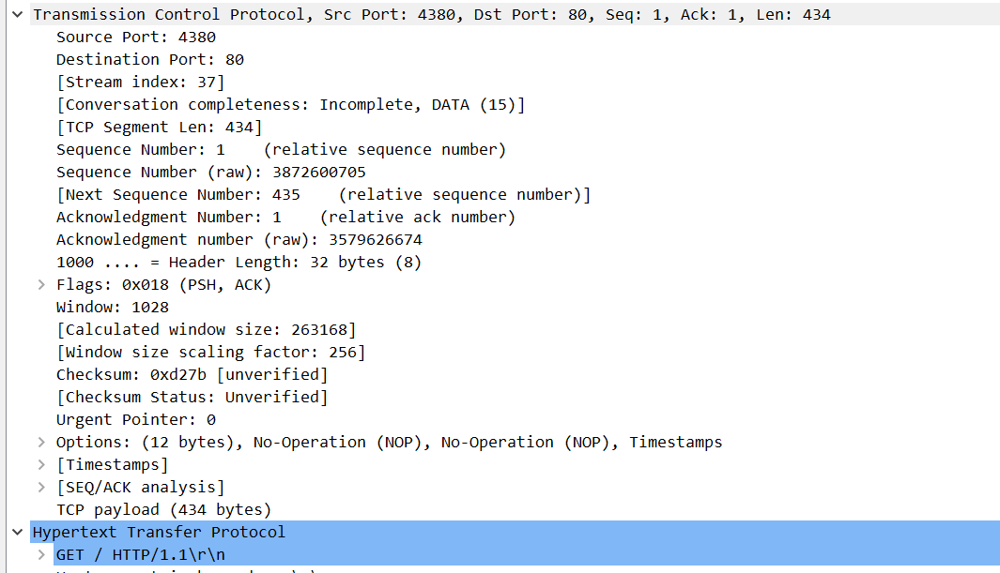

# 计算机网络

## 期末考查实验报告

**（2022学年秋季学期）**

| **教学班级** | **计科二班** | **专业（方向）** | **计算机科学与技术** |
| ------------ | ------------ | ---------------- | -------------------- |
| **学号**     | **20337263** | **姓名**         | **俞泽斌**           |

## 一、实验题目

重新启动一台配置好上互联网的计算机后，
（1） 运行 Wireshark 软件准备分析上网行为，启动抓取网络数据。
（2） 输入一个 网址 http://www.tsinghua.edu.cn， 一直到整个网页显示。
请记录并分析：
（1）应用层协议的运行的协议。依据网络数据说明相关协议的基本运行情况及其作用。
（2）按实际测试，网页自动跳转运行 https 协议。请分析其应用层与传输层协议的消息交换过程。  

## 二、实验过程

#### 1、基础设置

一开始其实应该进行DHCP和ARP协议的运行，但是我们的机器已经联网成功，所以本次实验中不涉及，主要也就是通过操作系统生成一个DHCP请求报文，然后封装到UDP报文中，放置在以太网帧中进行广播，最后通过DHCP服务器为本机分配具体的ip地址，可以通过

```dos
ipconfig
```

命令来查看我们电脑的ip地址


可以看到此时电脑的ip地址为192.168.101.39，即DHCP、ARP等协议已经被执行并记录在了机器中，得到了具体的ip地址。

可以将此时的ip地址作为wireshark的过滤条件，即`ip.addr ==192.168.101.39 `并开始抓包


此时得到的数据包的数量是非常庞大的，开始对上述的数据包进行分类的分析

#### 2、DNS分析

首先来看序号为3032-3037的四行DNS协议过程，上面是本机192.168.101.39向本地的DNS服务器发送了两个请求，分别请求此时ipv4地址和ipv6地址，然后本地DNS服务器向本机返回地址，来看具体报文


上面是第一个请求的报文，采用ipv4的协议，源地址为本机地址192.168.101.39，目标地址为本地DNS服务器地址192.168.101.1，因为DNS协议是运行在UDP协议上的，所以这里的Protocol是UDP，并且我们可以看到DNS 查询的地址即为本地的路由器，这是因为家用的路由器往往承担的不只是路由的功能，还会承担本地的 DNS 服务器，DHCP 服务器等功能。 并且在queries项中也包含了我们所需要查询的域名https://www.tsinghua.edu.cn/

第二个报文如下，基本与上述情况相同，唯一区别是请求的是https的类型，即ipv6地址


接下来的两个DNS类型的报文即为本地DNS服务器对于上面两个请求报文的响应


此时可以看到本地DNS服务器对于主机所发送的请求作出了回应，给出了具体的ip地址166.111.4.100


第二个响应报文也对第二个请求作出了回应，至此，通过DNS解析域名得到ip地址的部分完成

#### 2、HTTP协议

##### 1）tcp握手

http协议是基于tcp协议的，所以在wireshark中我们看到的首先是tcp协议所得到的数据包，三次握手，具体如下


序号为3038-3046，分别为SYN，SYN，SYNACK，ACK类型，与基础的TCP三次握手情况有点区别，基础的TCP三次握手即首先客户端先向服务器端发送一个TCP报文，标记位为SYN，表示“请求建立新连接”;

第二阶段是服务器端收到来自客户端的TCP报文返回一段报文标志位为SYN和ACK，表示“确认客户端的报文Seq序号有效，服务器能正常接收客户端发送的数据，并同意创建新连接”

第三阶段客户端接收到来自服务器确认收到数据的TCP报文后，明确了从客户端到服务器的数据传输是正常的，并返回一段TCP报文，标志位为ACK，表示“确认收到服务器端同意连接的信号”

而这里可能是序号为3038的SYN数据包未收到回应超时，进行了重传 ，重传后也符合上面流程

具体可以来看一下第一个报文


可以看到此时的协议为TCP，源地址为客户端即本机192.168.101.39，目标地址为166.111.4.100（通过DNS服务器解析出的地址），标志为SYN，端口为80，符合我们上面的叙述。

##### 2）重定向




然后开始进入http协议的get请求，请求的地址即为上面所请求的 www.tsinghua.edu.cn ，且从目标 IP 地址为166.111.4.100 即为上面 DNS 查询的 A 记录的响应，传输层的 TCP 协议目标的端口为 80，也是标准的 HTTP 协议的服务端口，同时运行的 HTTP 协议版本为 HTTP 1.1。  发送http请求后另一方也返回了tcp协议的SYN，ACK包，符合TCP的协议要求

对于这个get请求，作出的回应为序号为3060的HTTP报文，响应为302 found，一般意味着重定向，即资源存在，但是位置不再原先位置  ，具体报文如下


可以看到源地址http://www.tsinghua.edu.cn/被重定向到https://www.tsinghua.edu.cn/，由原先的http协议转到https协议，接下来本地对于这个重定向的地址进行了再一次的DNS查询，


同样的，经过这一次DNS查询后也需要进行tcp的三次握手才能与新的地址建立tcp连接


与上面的情况基本相同，就不重新再次进行介绍了，握手成功后，进入到 TLS 握手阶段  

##### 3）TLS握手


具体来看第一条的报文


可以看到，传输层协议下，发送端口仍为4381，目标端口不再是之前的 80 端口，而是变更为了https协议的默认端口443   ，同时报文中多出了一项为transport layer security 部分，表明加密协议为TLSv1.3，握手协议，客户端的hello，然后把客户端所支持的版本TLS发送过来，并给出了session ID，即本地将自己支持的加密方法，支持的 TLS 版本以及其余参数打包成报文发送到服务端。服务端响应如下


传输层协议下，发送端口为443，目标端口为4381，此时服务器在收到客户端的请求后，返回Server Hello，其中包括服务端的TLS版本，具体的session ID还有Cipher Suite（表示后面建立的加密通信）， TLS 的握手到此就结束了，之后便是通过这个建立的加密连接进行通信  

之后所得到的报文，都是Application Data形式的加密通信，无法进行解码了，保护了数据传输的安全性


之后便是通过这个建立的加密连接进行通信  


其中未加密的tcp协议都是发送的ACK包，只是一个响应，不涉及具体的数据，同时数据包也能看到 TCP ，便于流水线以及拥塞控制，所以ACK不需要进行加密操作，就如上图所示。

### 三、总结

综上，一台已经联网的计算机上 http://www.tsinghua.edu.cn的网页，主要涉及以下几方面的交互

首先是本地客户端和DNS服务器（本地路由器）之间：主机发送DNS的两次查询，分别查询ipv4和ipv6的ip地址，DNS服务器发送两次响应包含对应的ip地址

然后是本地客户端和网页服务端166.111.4.100之间：

1、tcp的三次握手

2、http get请求     http 302found重定向

3、tcp三次握手

4、TLS握手

5、加密通信数据

具体画图如下


具体的已经在第二部分做了具体阐述，至此实验结束。

