# 计算机网络

## 实验报告

**（2022学年秋季学期）**

| **教学班级** | **计科二班** | **专业（方向）** | **计算机科学与技术** |
| ------------ | ------------ | ---------------- | -------------------- |
| **学号**     | **20337263** | **姓名**         | **俞泽斌**           |

| **教学班级** | **计科二班** | **专业（方向）** | **计算机科学与技术** |
| ------------ | ------------ | ---------------- | -------------------- |
| **学号**     | **20308003** | **姓名**         | **曾伟超**           |

### 一、	实验题目

OSPF 单区域实验  

掌握在路由器上配置OSPF单区域		

### 二、实验步骤

#### 步骤1：

（1）按照拓扑图配置PC1和PC2的IP地址、子网掩码、网关，并测试他们的连通性

配置PC1的ip地址为192.168.5.11

配置PC2的ip地址为192.168.3.22，接下来从PC1向PC2执行ping命令

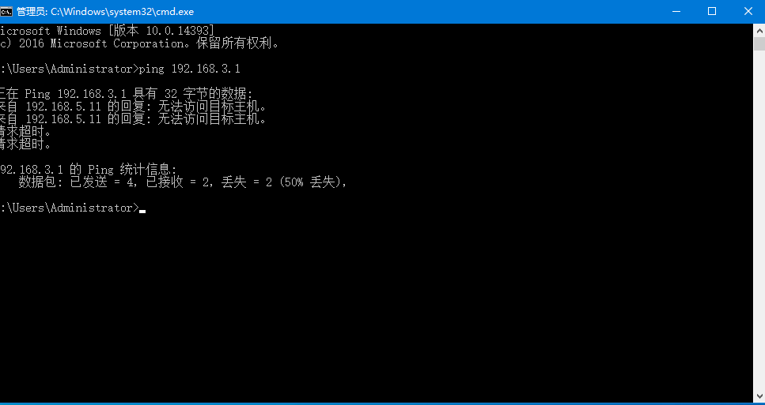

可以看到此时两个机器没有连通

（2）在路由器R1上执行show ip route 命令，记录路由表信息

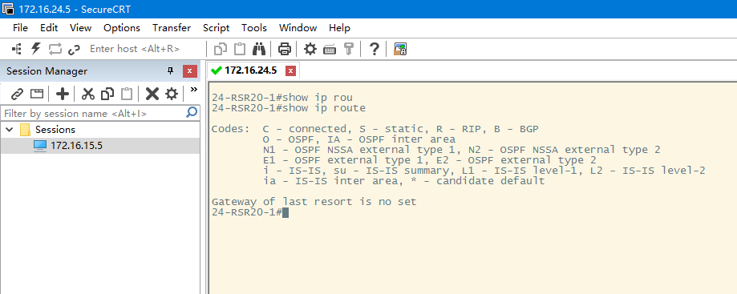

此时路由表很干净，没有多余信息，可以直接开始配置

#### 步骤2：

关于三层交换机的基本配置

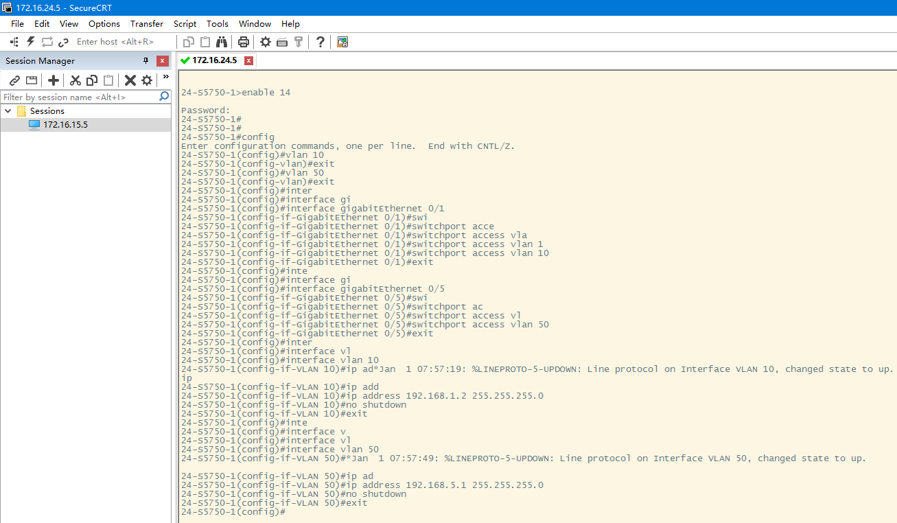

配置完成

#### 步骤3：

路由器R1的基本配置

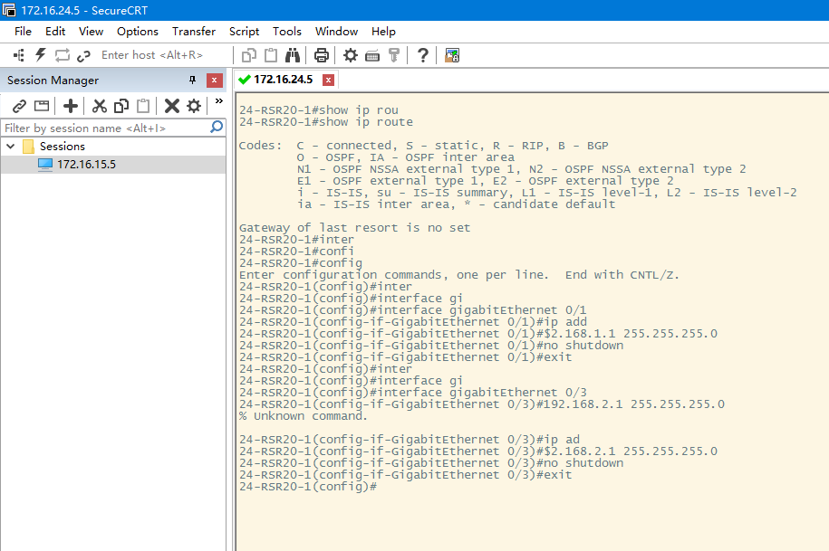

因为我们的路由器没有串口，所以也是采用端口来进行配置，具体就是注意端口号即可

#### 步骤4：

路由器R2的基本配置

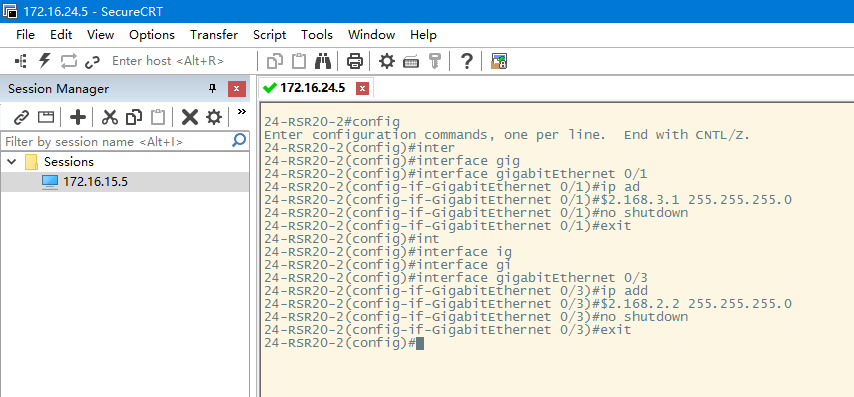

#### 步骤5：

配置OSPF路由协议，交换机S5750配置OSPF

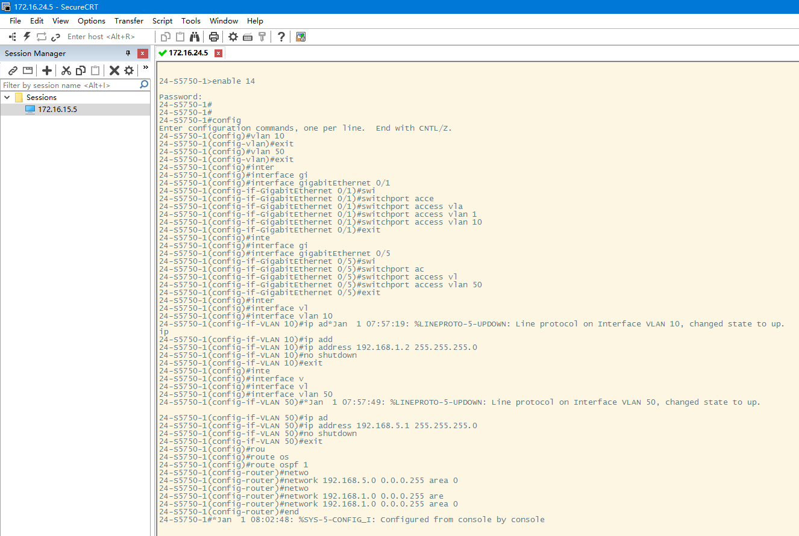

#### 步骤6：

路由器R1配置OSPF

#### 步骤7：

路由器R2配置OSPF

#### 步骤8：

查看验证3台路由设备的路由表是否自动学习了其他网段的路由信息，请注意路由条目O项

交换机

##### 分析交换机S5750的路由表，表中有O条目吗？如果有，是怎样产生的

表中有O条目，两项分别表示192.168.2.0为目标地址的数据从192.168.1.1处进行，也就是我们最初配置的vlan10中的操作

后一项表示192.168.3.0为目标地址的数据也从192.168.1.1处进行，也是vlan中表示的操作，子网的选端口

主要是通过对于vlan10的配置，然后通过OSPF的自动学习网段的路由信息所生成的

R1

##### 分析交换机R1的路由表，表中有O条目吗？如果有，是怎样产生的

表中也存在O条目，主要是192.168.3.0为目标地址的数据从192.168.2.2处输出，以192.168.5.0为目标地址的数据从192.168.1.2处进行输出，主要规定了数据的输入以及输出端口的连接，也是我们所连接网线的几个端口，是由OSPF的自动学习网段的路由信息所生成的

R2

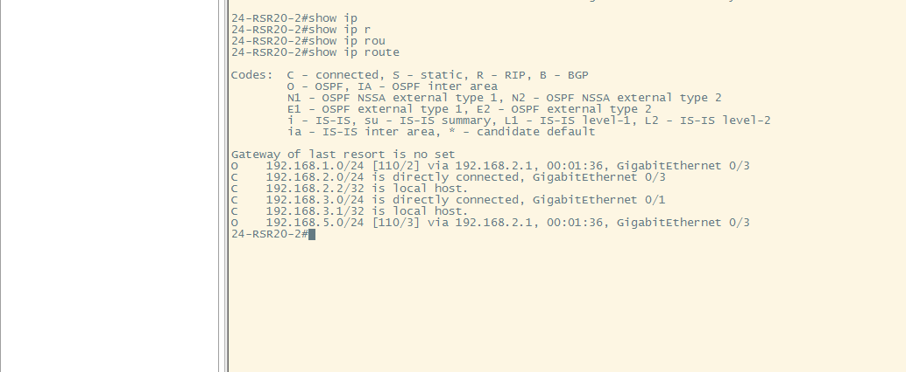

##### 分析交换机R2的路由表，表中有O条目吗？如果有，是怎样产生的

表中也存在O条目，主要是192.168.2.0为目标地址的数据从192.168.2.1处输出，以192.168.5.0为目标地址的数据从192.168.2.1处进行输出，主要规定了数据的输入以及输出端口的连接，是由OSPF的自动学习网段的路由信息所生成的

#### 步骤9：测试网络连通性

##### （1）将此时的路由表与步骤0的路由表进行比较，有什么结论

此时的路由表R1

之前的路由表是没有任何联系的，包括我们的接线也是不存在的，首先可以看到此时192.168.1.0/24和192.168.2.0/24都是直接通过网线连接，后面也输出了具体的连接端口，而192.168.3.0/24和192.168.5.0/24的信息都是通过OSPF自动学习网段的路由信息所产生具体的路径，说明此时R1已经产生了完整的本次OSPF单区域试验的路由表。

##### （2）分析traceroute PC2的实验结果

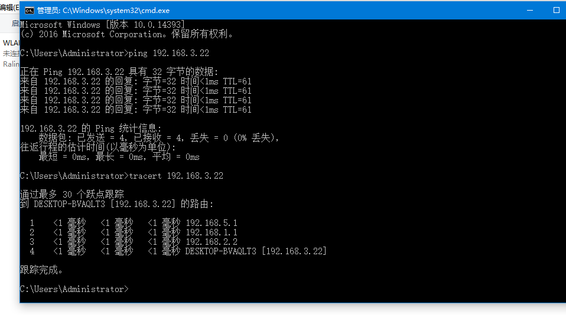

我们首先是通过ping命令来进行跑不跑通的测试的，然后再具体进行traceroute命令

通过此时的traceroute命令可以看到，对于PC2（192.168.3.22），PC1所产生的数据包首先通过192.168.5.1也就是PC1在交换机上的输入端口，然后通过交换机到达192.168.1.1即路由器R1的输入端口，再通过R1到达R2的输入端口192.168.2.2，最后通过R2传输到目标地址192.168.3.22，说明整个单区域试验的连通性完好。

##### （3）捕获数据包，分析OSPF头部结构。OSPF包在PC1上能捕获到吗？如果希望2台主机都能捕获到，请描述方法

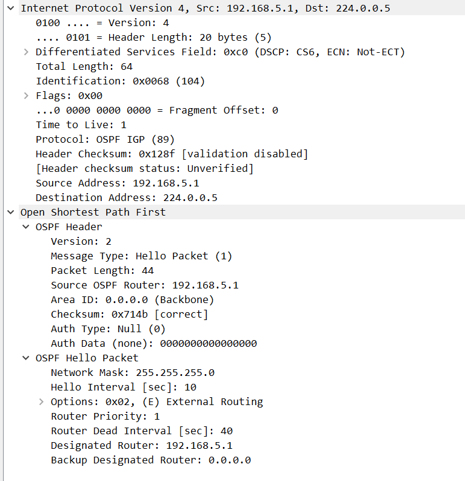

首先是在pc1上捕获的OSPF报文，分析首部信息

version 2：指版本为2

Message Type: Hello Packet(1) ：代表消息类型为1类型，hello包，建立和维持邻居关系

Packet Length: 代表具体的包的大小为44 

Source OSPF Router:192.168.5.1：代表OSPF的路线来源，这里是交换机对应的端口地址

Area ID ：0.0.0.0 :代表此时的区域标志，我们的设置为单区域，area 0

checksum ：检验和

##### （4）使用#debug ip ospf 命令显示上述OSPF协议的运行情况，观察并保存路由器R1发送和接受的update分组，注意其中LSA类型，观察有无224.0.0.5、224.0.0.6的ip地址，如有说明这两个地址的作用

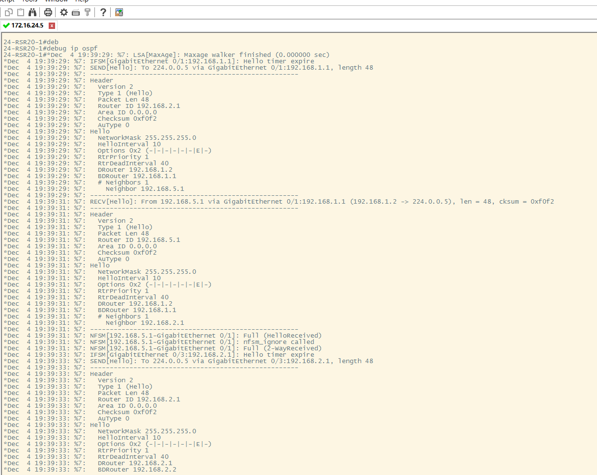

存在224.0.0.5的地址，在send hello数据包时，会向此地址发送一个hello数据包，224.0.0.5指所有的路由器，在所有路由器开机后，路由器通过组播地址224.0.0.5发送HELLO 包，进行路由器的互相通信

没有224.0.0.6,地址，因为本实验不存在DR/BDR，而只有在DR 和BDR确定后，BRother才会通过组播地址224.0.0.6给DR和BDR发送消息

在我们通过将网线拔出后重新接入，得到了如下图所示的LSA数据包

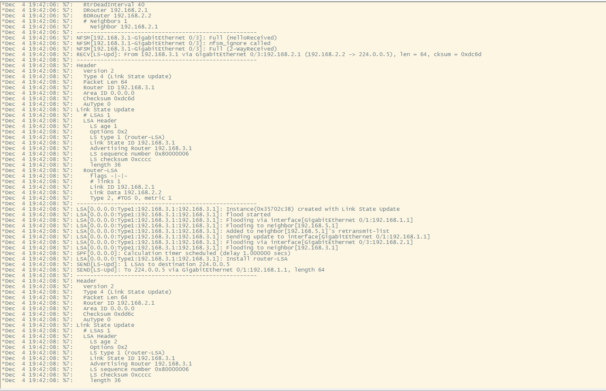

此时的LSA是Router类型的，type1，用来生成这条LSA路由器的router id

##### （5）本实验有没有DR/BDR?

无，因为本实验是点到点（串行链路），不需要DR、BDR的选举 

### 三、 实验思考

#### （1）如何查看OSPF协议发布的网段？

在路由器上使用show [ip](http://ip.vevb.com/) route命令查看其IP路由表，可以看到有2条行首标注为"O"的路由项，它们就是由OSPF协议学习到的路由。

在这些查看到了路由为起始地址，就为发布的网段

#### （3）请问192.168.2.0/28的反掩码是多少？

255.255.255.255-192.168.2.0/28=63.87.253.240/28

