# 计算机网络

## 实验报告

**（2022学年秋季学期）**

| **教学班级** | **计科二班** | **专业（方向）** | **计算机科学与技术** |
| ------------ | ------------ | ---------------- | -------------------- |
| **学号**     | **20337263** | **姓名**         | **俞泽斌**           |

| **教学班级** | **计科二班** | **专业（方向）** | **计算机科学与技术** |
| ------------ | ------------ | ---------------- | -------------------- |
| **学号**     | **20308003** | **姓名**         | **曾伟超**           |

### 一、	实验题目

ARP协议分析

了解IP地址和MAC的地址之间的关系

掌握ARP命令的使用

掌握ARP协议的工作细节

了解ARP欺骗的原理和相关的攻击防范方法

### 二、  实验步骤

#### 步骤1：连接好设备，配置两台计算机的ip地址和掩码

配置好后用ipconfig命令查看

pc1:

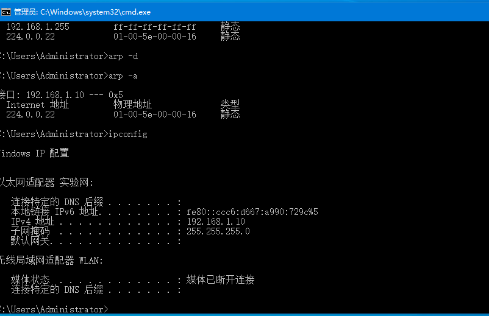

pc2:

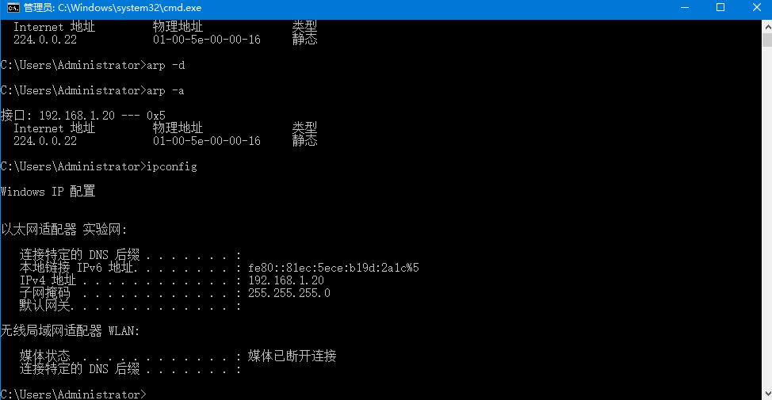

可以看到此时的ip地址配置完成

#### 步骤2：在两台计算机的命令窗口执行arp-a命令，查看高速缓存中的ARP地址映射表的内容

#### 步骤3：在两台计算机的命令窗口执行arp -d命令，清除ARp缓存；清楚后可再用arp-a命令验证，记录实验结果

首先查看pc1高速缓存中的ARP地址映射表的内容

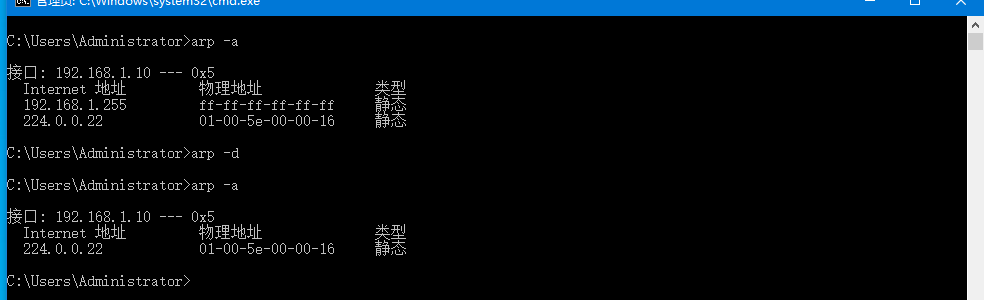

可以看到里面是没有pc2的地址的，使用arp-d清除后只有一个条目，也不存在pc2地址，上一个条目可能是我们在使用ping命令后未清除缓存

pc2的

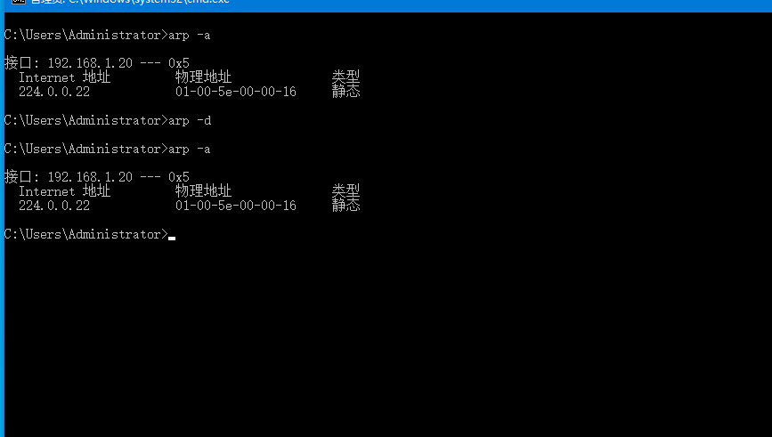

可以看到pc2的arp映射表中就只有一个条目，不存在pc1的地址

#### 步骤5：在主机pc1上执行pingpc2的命令，以产生数据报

输入命令后执行

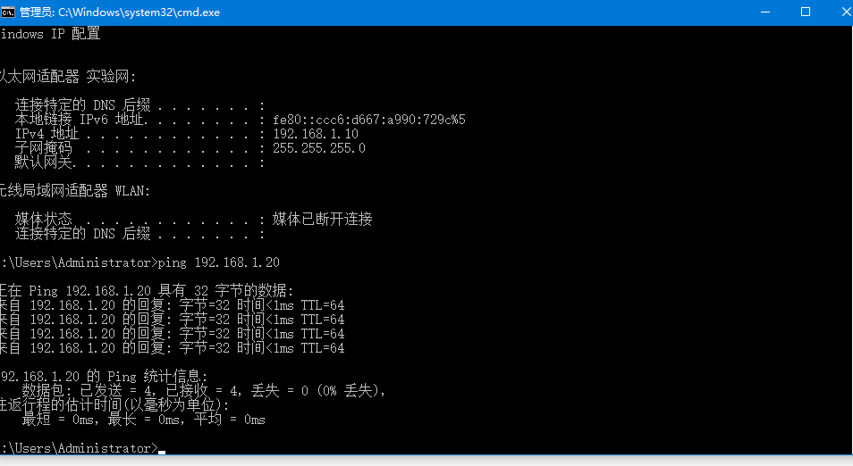

可以看到实现ping通

#### 步骤7：在两台计算机上再次执行arp-a命令，查看高速缓存中的arp地址映射表的内容，并回答以下问题

##### （1）步骤7 的实验结果与步骤3是否相同，由此说明ARP高速缓存的作用。

不相同，ARP高速缓存的作用，首先当源主机需要将一个数据包发送到目标主机，就会检查自己的ARP高速缓存表有没有该IP地址对应的MAC地址，如果有就 直接发送到这个MAC地址，如果没有就进行广播，网络中所有的主机收到ARP请求，检查ip是否和自己的ip一致，如果不相同就忽略，相同就发送ARP响应数据包并且将发送端地址加入自己的的ARp映射表，ARP高速缓存的作用就是存储最近的ip地址和mac地址的映射关系，减少广播的次数，更快地找到mac地址

##### （2）贴出步骤7中高速缓存ARP地址映射表截图

pc1

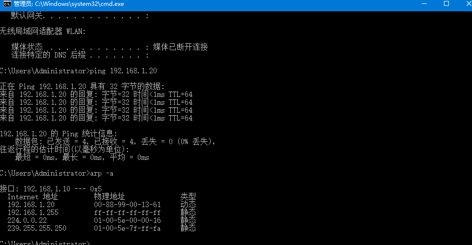

pc2

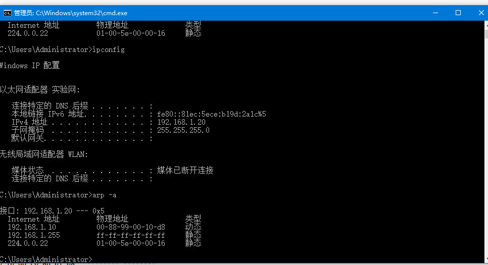

#### 步骤9：打开arp-1，回答以下问题

##### （1）捕获的报文中有几个ARP报文，在以太网帧中，ARP协议类型的代码值是什么

pc1（发送方）中存在4个arp报文

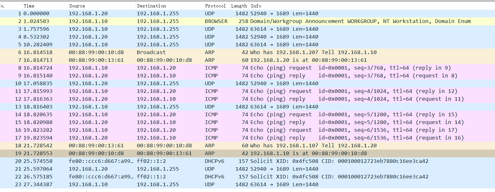

pc2（接收方）也存在4个arp报文

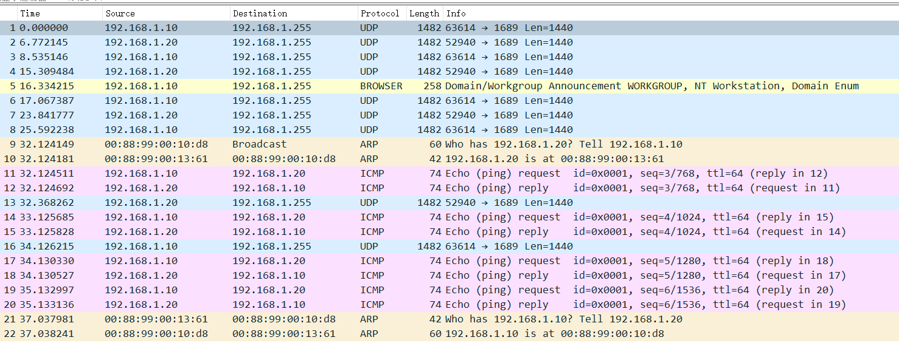

以太网帧中，ARP协议类型的代码值是0x806

##### （2）打开arp-2，比较两次捕获的报文有何区别，分析其原因

pc1-arp-2

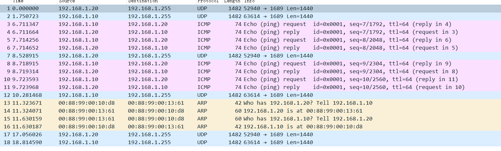

pc2-arp-2

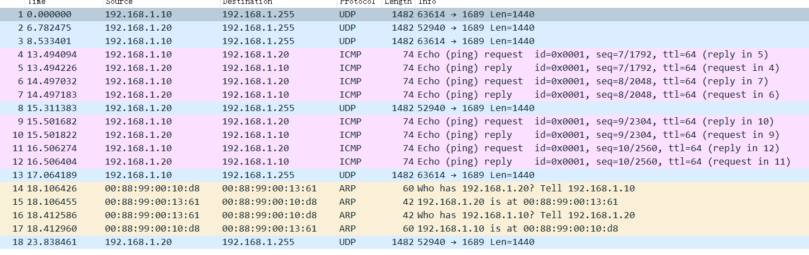

arp-2捕获的报文中arp协议的报文都集中在一起，就中间不需要通过广播的形式来找到具体的mac地址，而是通过高速缓存表来直接获取

是因为在第一次ping命令下，pc1已经通过广播得到了pc2的mac地址，并保存到了arp高速缓存表中，所以可以直接取用

##### （3）根据ARP报文格式，分析arp-1中ARP报文的结构

就以pc1中arp1的请求和应答为例

请求

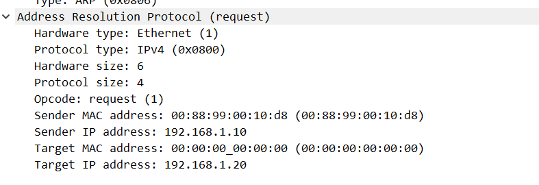

应答

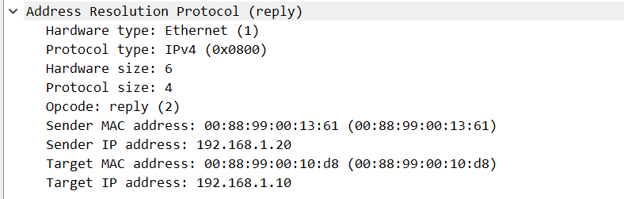

| ARP请求报文  |                   | ARP应答报文  |                   |
| ------------ | ----------------- | ------------ | ----------------- |
| 字段         | 报文信息及参数    | 字段         | 报文信息及参数    |
| 硬件类型     | Ethernet          | 硬件类型     | Ethernet          |
| 协议类型     | ipv4              | 协议类型     | ipv4              |
| 硬件地址长度 | 6                 | 硬件地址长度 | 6                 |
| 协议地址长度 | 4                 | 协议地址长度 | 4                 |
| 操作         | request           | 操作         | reply             |
| 源物理地址   | 00:88:99:00:10:d8 | 源物理地址   | 00:88:99:00:13:61 |
| 源ip地址     | 192.168.1.10      | 源ip地址     | 192.168.1.20      |
| 目的物理地址 | 00:00:00_00:00    | 目的物理地址 | 00:88:99:00:10:d8 |
| 目的ip地址   | 192.168.1.20      | 目的ip地址   | 192.168.1.10      |

### 三、实验思考