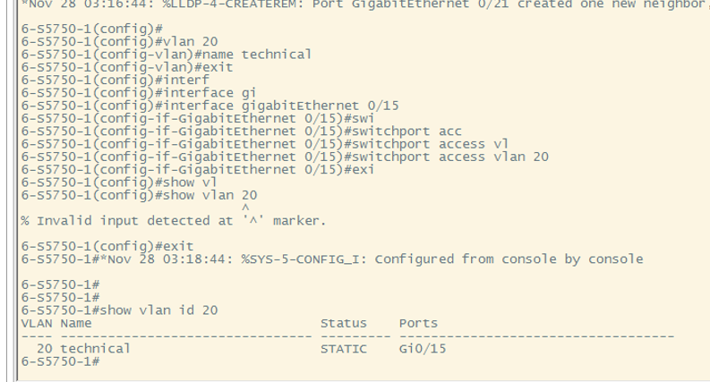

# 计算机网络

## 实验报告

**（2022学年秋季学期）**

| **教学班级** | **计科二班** | **专业（方向）** | **计算机科学与技术** |
| ------------ | ------------ | ---------------- | -------------------- |
| **学号**     | **20337263** | **姓名**         | **俞泽斌**           |

| **教学班级** | **计科二班** | **专业（方向）** | **计算机科学与技术** |
| ------------ | ------------ | ---------------- | -------------------- |
| **学号**     | **20308003** | **姓名**         | **曾伟超**           |

### 一、	实验题目

##### 单交换机实现VLAN

##### 跨交换机实现VLAN

### 二、	实验步骤

#### 1、单交换机实现VLAN

##### 步骤一：在未划分vlan前测试3台计算机的连通状态

###### （1）用命令行netsh命令配置网卡ip

第一步先将三个pc的ip设置为192.168.10.10，192.168.20.20，192.168.30.30，测试

可以看到ping 不通，因为定义的子网掩码是255.255.255.0，所以这三个pc并不在同一个子网内，无法互相连通

###### （2）重新配置网卡ip

现在改变pc的ip地址为192.168.10.10，192.168.10.20，192.168.10.30执行ping命令，通过pc1来测试连通性

然后测试pc2和pc3之间的连通性，通过pc2 ping pc3来测试

可以看到此时均能ping 通，因为三台计算机在同一个子网内且并未划分vlan，此时三台计算机互相连通

###### （3）查看交换机的vlan配置情况

###### （4）查看交换机的地址表

结果如上图，可以看到交换机的地址表上有接口号以及pc所对应的mac地址号，此时也可以看到三个pc处于同一个vlan及vlan1下

##### 步骤2：创建vlan

此时可以看到创建vlan后vlan表中出现了test10和test20的标志，同时因为并未分配端口，所以ports项为空

此时测试3台pc的连通性，发现均连通，就不再展示

##### 步骤三：将端口分配到vlan

可以看到与之前相比，vlan表中的test10和test20的ports表项中多出了具体的端口号，表明已经为这两个新的vlan分配了端口

##### 步骤4：实验验证

启动监控软件wireshark，用ping命令查看3台主机连通性并观察

###### （1） PC1与 PC2、PC3 能否连通?

pc1与pc2不连通，pc1与pc3也不连通，具体如图

###### （2）能否监控到 PC1、PC2(PC3)的 ICMP包?

未监控到pc1的ICMP包

###### （3）在捕获的数据包中有没有包含 VLAN ID?说明原因。

包含了vlan ID，在LLDP包中

因为最后以及划分好了具体的vlan，此时pc1已经接在了vlan test10的端口上，所以所得到的数据包中会有vlan id，来保证同一vlan下的才会连通

###### （4）查看交换机的地址表,说明其与实验开始时有什么不同。清除地址表,适当更改网线楼口,然后观察与分析地址表的形成与变化过程(

与刚开始的进行对比，区别在于vlan号，一开始默认划分，vlan都为1，之后手动分配，vlan值为设定

更改网线接口后mac地址不变，插入后显示mac地址对应的接口，同时将vlan值默认设成1，手动配置后vlan值为所需值

#### 2、跨交换机实现VLAN

##### 步骤 1: 实验前的测试。

###### (1) 实验开始时,用 netsh 命令将 PC1、PC2、PC3 的网卡分别配置如下 IP掩码:PC1 192.168.10.10 255.255.255.0    PC2 192.168.10.20 255.255.255.0   PC3 192.168.10.30 255.255.255.0

验证3台主机是否可以两两互相 ping通。

三台主机可以相互ping通，实验结果图与6-1中一致，就不加赘述，在同一子网下且没有vlan划分，均为1，可以ping通

###### （2）记录交换机A和交换机B之间的vlan信息

交换机A

交换机B

##### 步骤2：:在交换机上创建VLAN10,并将端口0/5分配到 VLAN10中

###### （1）在交换机A上通过命令 show vlan id 10 验证是否已创建vlan10，查看端口0/5是否已经被分配到vlan10中

如上图，可以看到Gi 0/5被分配到了vlan10中

（2）检查pc1，pc2，pc3的连通情况

此时pc1与pc2，pc1与pc3不连通，因为不属于同一个vlan ，pc2和pc3都是默认的vlan1

pc2与pc3连通，因为同属一个vlan1

##### 步骤3：在交换机 A上创建 VLAN 20,并将 0/15划分到 VLAN 20中

###### （1）在交换机A上通过命令 show vlan id 20 验证是否已创建 VLAN 20，查看0/15否划分到 VLAN20中

如上图，可以看到此时Gi 0/15被分配到了vlan20中

######   (2)检查 PC1、PC2、PC3 此时的连通情况

此时pc1，pc2，pc3均不连通

##### 步骤4: 将交换机A 与交换机 B相连的口(假设为端口 0/24)定义为 Tag VLAN模式。

验证测试

验证测试:检查 PC1PC2PC3 此时的连通情况

此时pc1，pc2，pc3均不连通

##### 步骤5:在交换机 B上创建 VLAN 20,并将端口0/5 划分到 VLAN 20中

###### （1）验证已在交换机B上创建 VLAN 20,查看 0/5 的划分情况

通过show vlan命令得到上图，可以看到此时端口0/5已经划分到了vlan20中

###### （2）验证测试:检查 PC1PC2PC3 此时的连通情况

此时pc1，pc2，pc3均不连通

##### 步骤6: 将交换机B 与交换机 A相连的口(假设为端口 0/24)定义为 Tag VLAN模式。

##### 步骤7:验证 PC2与PC3能相互通信,但 PC1与 PC3不能互相通信

pc2与pc3

pc1与pc3

##### 启动监控软件wireshark，使用ping命令测试三台主机的连通性，并进行以下观察

###### （1）主机之间能否互相通信?

PC2与PC3能相互通信,但 PC1与 PC3不能互相通信

###### （2）能否监测到 PC1、PC2PC3 的ICMP包?

可以，如图

###### (3)能否捕获到 Trunk 链路上的 VLAN ID?请讨论原因。

无法捕获到vlan id ，

###### （4）查看交换机的地址表,说明其与实验开始时有什么不同。清除地址表,适当更改网线楼口,然后观察与分析地址表的形成与变化过程(