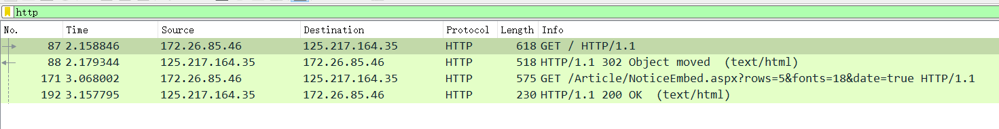
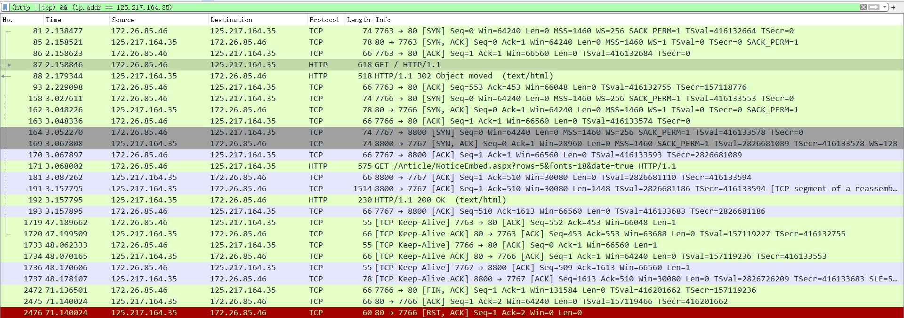

**计算机网络**

**实验报告**

**（2022学年秋季学期）**

| **教学班级** | **计科二班** | **专业（方向）** | **计算机科学与技术** |
| ------------ | ------------ | ---------------- | -------------------- |
| **学号**     | **20337263** | **姓名**         | **俞泽斌**           |

### 一、   实验题目

 1、掌握HTTP协议获取网页的流程

2、了解HTTP请求报文和响应报文的格式，并进行报文分析

3、了解HTTP1.0和HTTP1.1的区别

### 二、   实验内容

首先打开wireshark软件来进行抓包，然后我选择了http://home3.sysu.edu.cn/finance/作为抓包的网址，开始捕获WLAN后打开网址，抓到如下图

其实这里开始的时候发现有两次的来回，第一次网站返回的是302的代码，也就是要跳转的网站，后面才得到200 ok的代码，说明网站访问成功，具体这里的理解主要是第一次可能是类似于握手的操作，就是确认一下有这个网址，然后第二次才是正式的访问，访问的来回两个包，一个是浏览器发送到网站对应位置的，另一个获取的网站返回的信息。

我们这里主要取的是返回代码为200 的两个报文，然后下面的报文我们做具体的分析，首先是请求报文的部分，首先把所有的报文都展开来

(1)

其实主要看的是下面的这段报文

http请求报文

| 方法 | get  | 版本 | 1.1  | URL  |      |
| ---- | ---- | ---- | ---- | ---- | ---- |

|                 |                                                           |                                            |
| :-------------- | --------------------------------------------------------- | ------------------------------------------ |
| 首部字段名      | 字段值                                                    | 字段所表达的信息                           |
| HOST            | finance.sysu.edu.cn:8800                                  | 请求的主机名，资源所在的服务器             |
| Connection      | keep-alive                                                | 客户端和服务端指定的请求，响应有关选项     |
| User-Agent      | Mozilla,AppleWebKit/537.36,Chrome/105.0.0.0 Safari/537.36 | 发送请求的操作系统和浏览器信息             |
| Accept          | * / *                                                     | 客户端可识别的内容类型列表，这里表示都可以 |
| Referer         | http://home3.sysu.edu.cn/                                 | 判断来源页面                               |
| Accept-Encoding | gzip, deflate                                             | 客户端可识别的数据编码                     |
| Accept-Language | zh-CN,zh;q=0.9                                            | 浏览器所支持的语言类型                     |
| Cookie          | ASPSESSIONIDCADTRTSB=BIDHCGJBPJIPGGLPECFFPNHM             | 发出http请求时会默认携带的一段文本片段     |

(2)

接下来是返回的报文

其实主要看的也是下面的这段报文

http应答报文

| 版本 | 1.1  | 状态码 | 200  | 短语 | ok   |
| ---- | ---- | ------ | ---- | ---- | ---- |

| 首部字段名     | 字段值                                                       | 字段所表达的信息                 |
| -------------- | ------------------------------------------------------------ | -------------------------------- |
| Server         | nginx/1.22.0                                                 | 服务器信息及版本                 |
| Date           | Fri ,09 Sep 2022 12:07:01 GMT                                | 响应时间                         |
| Content-Type   | text/html;charset=utf-8                                      | 告诉客户端实际返回的类型         |
| Content-Length | 1347                                                         | http消息主体的大小               |
| Connection     | keep-alive                                                   | 连接状态，长连接                 |
| cache-control  | private                                                      | 缓存机制，仅开放给部分用户做缓存 |
| set-cookie     | ASP.NET_SessionId=p4yohj4wlrf1sthdqd3hwnx0; path=/; HttpOnly; SameSite=Lax | 默认携带的一段文本片段           |

（3）

现在综合分析捕获的报文，理解HTTP协议的工作过程

首先我们来看具体的捕获到的包

可以看到首先finance.sysu.edu.cn的请求，服务器将原先的 http 链接重定向至 https 链接，所以第一段返回的是304 not modified

后面定位到了home3.sysu.edu.cn/finance  后才返回200 ok，现在我们将过滤放开来看下具体的工作，因为此时重定向后的这个网站的ip地址为125.217.164.35，所以将这个来作为过滤条件，得到过滤条件为(http ||tcp) && (ip.addr == 125.217.164.35)   

http协议工作过程

| 客户机端口号 | 服务器端口号 | 所包括的报文号 | 工作过程                                                     |
| ------------ | ------------ | -------------- | ------------------------------------------------------------ |
| 7763         | 80           | 81             | 客户端发送给服务器 SYN 数据包，并请求连接                    |
| 80           | 7763         | 85             | 服务端返回 SYN 和 ACK数据包，返回连接请求和数据              |
| 7763         | 80           | 86             | 客户端返回 ACK 报文，说明客户端可以开始接受数据，也是tcp的三次握手成功 |
| 7763         | 80           | 87             | 第一次开始发送GET请求                                        |
| 80           | 7763         | 88             | 服务端重定向至其他地址，返回 302 object moved                |
| 7767         | 80           | 164            | 客户端发送给服务器 SYN 数据包，再次请求连接                  |
| 80           | 7767         | 169            | 服务端返回 SYN 和 ACK数据包，返回连接请求和数据              |
| 7767         | 80           | 170            | 客户端返回 ACK 报文，说明客户端可以开始接受数据，tcp的三次握手成功 |
| 7767         | 80           | 171            | 第二次开始发送GET请求                                        |
| 80           | 7767         | 181,191        | 客户端返回 ACK 报文                                          |
| 80           | 7767         | 192            | 客户端返回200 ok ，开始传输数据                              |

（4）第一个HTTP会话中，Web服务器对Web客户端GET请求的回应是302 object moved ，相当于一次握手过程

​		  第二个HTTP会话中，Web服务器对Web客户端GET请求的回应是200 ok，表明请求成功

实验思考

（1）连接是由客户端发起建立的，通过先向服务端发送SYN数据包并请求连接的方式，然后等服务端返回SYN和ACK数据包，在发送ACK报文，握手成功后发送请求，请求被服务端接收并返回200 ok时，开始传输数据，HTTP会话建立成功

（2）关闭连接是由服务端发起的，断开连接时，发送 close_notify 报文。之后再发送 TCP FIN 报文来关闭与 TCP 的通信

（3）GET 用于信息获取，而且应该是安全的和幂等的POST 表示可能修改变服务器上的资源的请求，POST提交表单，因为这样就会涉及对服务器上的资源的修改，所以用POST，如果直接访问的话，用GET就可以了。
