# 计算机网络

## 实验报告

**（2022学年秋季学期）**

| **教学班级** | **计科二班** | **专业（方向）** | **计算机科学与技术** |
| ------------ | ------------ | ---------------- | -------------------- |
| **学号**     | **20337263** | **姓名**         | **俞泽斌**           |

### 一、   实验题目

1、学会在客户端使用nslookup命令进行域名解析

2、通过协议分析软件掌握DNS协议的报文格式

### 二、   实验内容

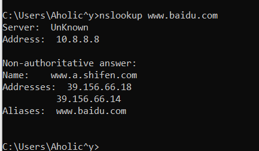

首先是打开wireshark开始抓包，然后在命令行中输入nslookup www.baidu.com的命令，得到如上反馈

打开wireshark的过滤器，使用DNS作为过滤条件，得到下面几帧

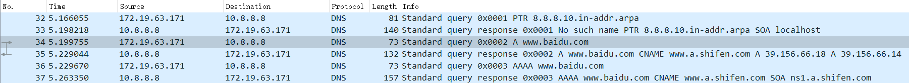

前两帧是通过反向查询获得本地DNS服务器的地址，之后的两帧是通过正向查询获得查询域名对应的IP地址，接下来的两帧也是一样的操作，不过对应的是ipv6的地址，接下来对报文进行具体分析

第一帧是172.19.63.171发送给本地DNS服务器10.8.8.8来反向查询取得报文

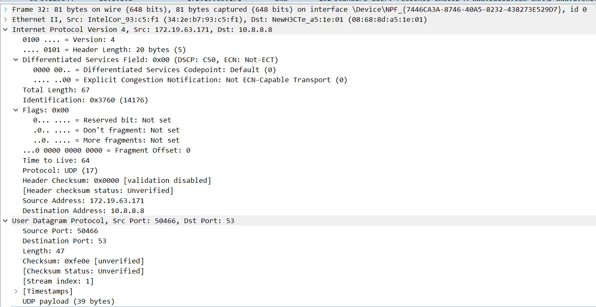

直接看应用层的报文，

| 首部字段名     | 字段值 | 含义                |
| -------------- | ------ | ------------------- |
| version        | 4      | 代表ip的规格版本为4 |
| header length  | 20     | 标头长度            |
| total length   | 67     | 总共的长度          |
| identification | 0x3760 | 识别码              |

然后可以看到source Address 和Destination Address分别为172.19.63.171和10.8.8.8，代表请求从网络开始传到本地的DNS服务器

同时Source port 和Destination Port为50466和53,53是DNS服务器的标准服务端口

最后一行看到使用协议为UDP

第二帧其实本地DNS服务器并没有返回具体的域名，但并不影响

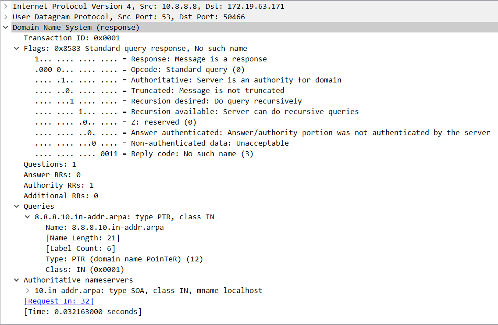

首先可以看到Flags下不断地在进行循环请求，然是最后的reply code为no such name，说明本地的DNS服务器并没有给请求来返回具体的域名地址。所以在最后返回的位置上可以看到Name为 8.8.8.10.in-addr.arpa，然后具体展开Authoritative nameserver（权威DNS）

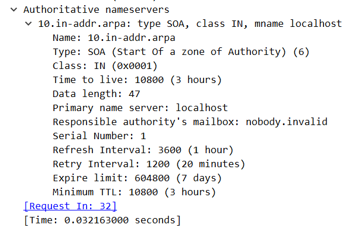

可以看到在primary name server 的页面也注明了localhost

第三帧是客户端发给本地DNS服务器的请求www.baidu.com的域名地址的请求报文

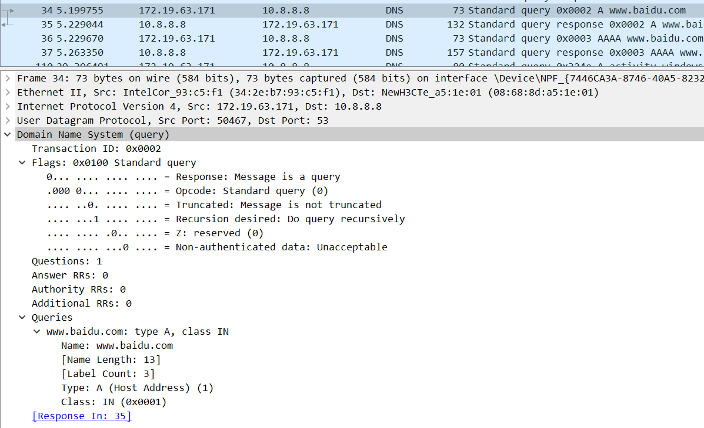

可以看到发出请求的是172.19.63.171，即本地客户端，接受请求的为10.8.8.8，为本地的DNS服务器

| 首部字段名                 | 字段值 | 含义                   |
| -------------------------- | ------ | ---------------------- |
| Questions                  | 1      | 代表查询的问题有多少个 |
| Answer RRs（回答）         | 0      | 代表返回的回答         |
| Authority RRs（授权）      | 0      | 代表返回的授权信息     |
| Additional RRs（额外信息） | 0      | 代表返回的额外信息     |

然后在报文的Queries下可以看到对于www.baidu.com的请求资源记录

第四帧是本地DNS服务器对客户端返回的www.baidu.com的域名和ip地址

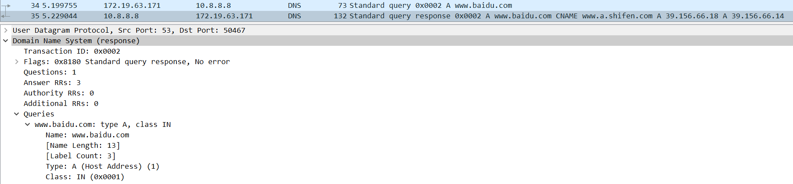

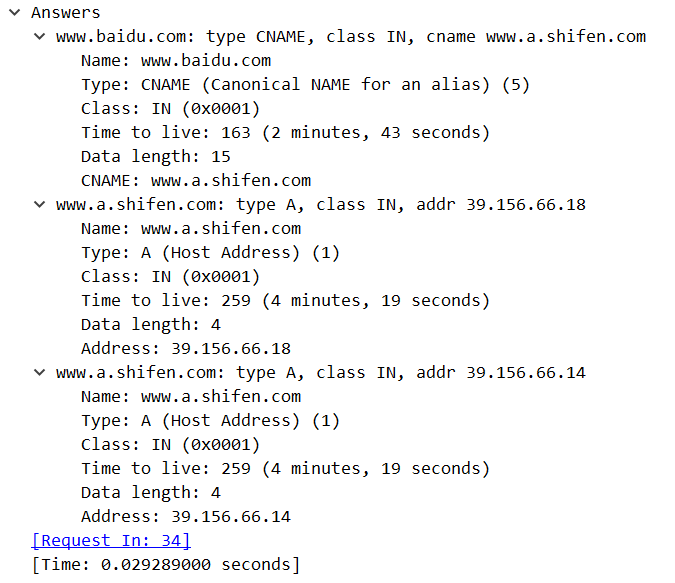

| 首部字段名                 | 字段值 | 含义               |
| -------------------------- | ------ | ------------------ |
| Questions                  | 1      | 代表查询的问题     |
| Answer RRs（回答）         | 3      | 代表返回的回答信息 |
| Authority RRs（授权）      | 0      | 代表返回的授权信息 |
| Additional RRs（额外信息） | 0      | 代表返回的额外信息 |

可以看到在Queries下还是那个问题，但是此时在下面的报文中出现了answer

answer分为了三个部分，分别是www.baidu.com和www.a.shifen.com(39.156.66.18)以及www.a.shifen.com(39.156.66.14)

后面两个都是www.baidu.com的初始名字，也是对应的真正域名，具体直接挑baidu.com来进行分析

| 首部字段名   | 字段值                    | 含义                    |
| ------------ | ------------------------- | ----------------------- |
| Name         | www.baidu.com             | 网址                    |
| Type         | A                         | 查询类型，A代表IPv4地址 |
| Class        | IN                        | 类域                    |
| Time to live | 163                       | 存活时间                |
| Data length  | 15                        | 数据长度                |
| Address      | 39.156.66.14/39.156.66.18 | IP地址                  |
| CNAME        | www.a.shifen.com          | 对应真正域名            |

第5帧是ipv6条件下客户端发给本地DNS服务器的请求www.baidu.com的域名地址的请求报文

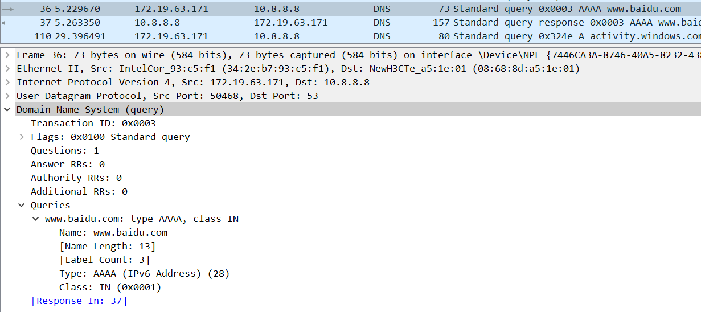

可以看到此时的Queries中type属性变成了AAAA，表示此时的为IPV6地址，其余没有大的变化

第6帧也是本地DNS服务器对客户端返回的www.baidu.com的域名和ip地址

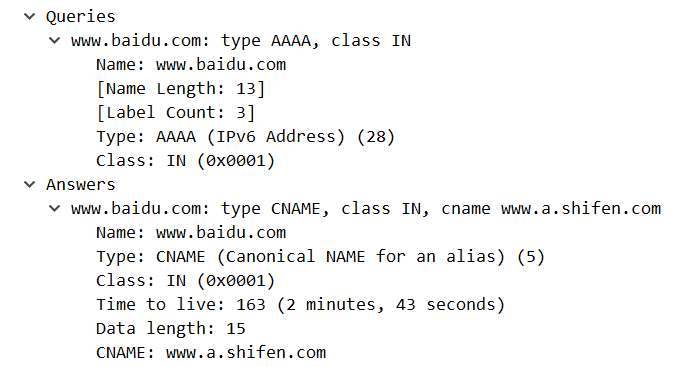

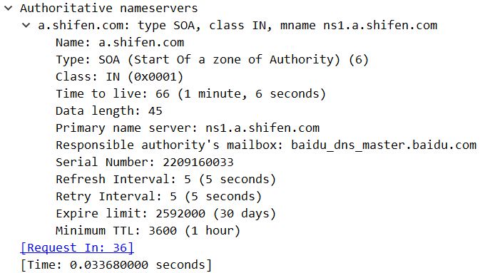

此时其实与第四帧相比区别不是很大，开始的Queries下只有Type的区别，之后的Answer下也一样，但ipv6多了个Authoritative nameservers，并且将a.shifen.com，也就是baidu.com的原始名字拿来做了具体的分析，具体的区别也就是type上的差别了

步骤4：再次访问www.baidu.com时，没有DNS请求

因为此时本地的DNS已经有了baidu.com的DNS缓存，所以不需要继续向本地DNS服务器来

步骤五：此时有DNS请求

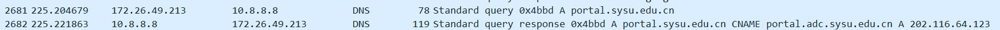

我这里访问的是portal.sysu.edu.cn，可以看到此时客户端也会向本地的DNS服务器来请求域名的解析，返回的报文中也展示了这个网址的具体ip地址。

步骤6 使用ipconfig/displaydns的命令来显示本机缓冲区所包含的DNS解析内容

这里因为太多，所以只截取部分

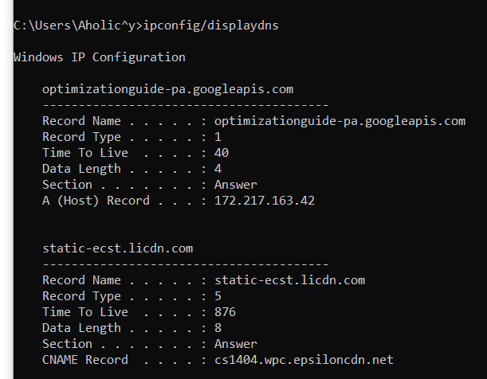

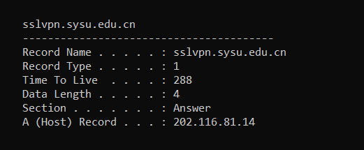

步骤7，使用ipconfig/flushdns清楚本机的DNS缓存记录

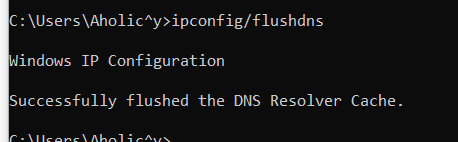

成功清除缓存内容

步骤8，关闭浏览器再打开，访问刚才打开过的网站，观察是否有DNS请求

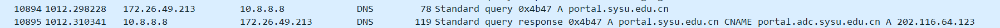

发现确实有DNS请求，因为本地的DNS缓存被清除，此时需要客户端重新向本地的DNS服务器来请求域名的解析，才能访问具体的地址

### 三、实验思考

1、DNS协议中的资源记录RR包含哪些内容

回答字段、授权字段、附加信息字段使用RR的相同格式，RR包含

域名：记录资源数据对应的名字

类型：说明RR的类型码

类域：与问题记录的查询类型字段相同

生存时间：客户程序保留该资源记录的秒数

数据长度：说明资源数据的数量

数据

2、DNS处理返回需查找的域名还可能返回哪些内容

还可以如果查找到了具体的域名，还会返回查询类型，类域，生存时间，数据长度

如果没有查找到，就会在reply里输出no such name，并开启下一次握手

3、反复试验，判断一个域名是否可以对应多个ip地址？域名与IP地址之间是不是一一对应的关系？

并不是一一对应的关系，一个域名可以对应多个ip地址，比如我们访问baidu.com的时候，

可以看到baidu.com的原名 www.a.shifen.com就有两个ip地址39.156.66.18和39.156.66.14，说明域名和ip不是一一对应的关系

4、若实验中无法进行DNS解析，请写出导致问题的原因以及解决办法

（1）网站故障，当发现打开某些网站会出现dns错误，但又有些大站打开一切正常，这种情况由于网站域名服务器故障。只需要换一个网站来进行实验即可

（2）网络故障，没网络打开网页，修复只需要修复网络问题即可

5、DNS协议何时用UDP？何时用TCP？

首先了解一下两者的概念

TCP：面向连接的协议，提供可靠的数据传输，一般服务质量要求比较高的情况，使用这个协议。

UDP：用户数据报协议，是一种无连接的传输层协议，提供面向事务的简单不可靠信息传送服务。

但是虽然TCP协议中植入了各种安全保障功能，但是在实际执行的过程中会占用大量的系统开销，无疑使速度受到严重的影响。

反观UDP由于排除了信息可靠传递机制，将安全和排序等功能移交给上层应用来完成，极大降低了执行时间，使速度得到了保证。

所以DNS在进行区域传输（即辅助DNS服务器启动时，它需要与主DNS服务器通信，并加载数据信息）的时候使用TCP协议，其它时候则使用UDP协议。
