# 计算机网络

## 实验报告

**（2022学年秋季学期）**

| **教学班级** | **计科二班** | **专业（方向）** | **计算机科学与技术** |
| ------------ | ------------ | ---------------- | -------------------- |
| **学号**     | **20308003** | **姓名**         | **曾伟超**           |

| **教学班级** | **计科二班** | **专业（方向）** | **计算机科学与技术** |
| ------------ | ------------ | ---------------- | -------------------- |
| **学号**     | **20337263** | **姓名**         | **俞泽斌**           |

### 一、   实验题目

#### 5.2 TCP 通信编程：

##### 【目的】选择一个自己熟悉的操作系统和语言，编写采用 TCP socket 的通信程序；

##### 【要求】编写服务器端和客户端程序。

​	客户端软件支持三个功能或者命令：远程（服务器）当前目录文件列表、上传文件、下载文件。
​	服务器端软件：按用户命令，支持客服端的以上功能或者命令：提供当前文件目录的文件列表、接收上传文件， 按客户端用户要求提供其要求的文件（文件下载）。 服务器必须提供日志记录以上操作及操作结果状态。
​	服务器端必须支持多个客户端的并发运行。可在屏幕显示客户端的请求及服务器端的处理日志。

##### 【测试要求】

1） A 机器运行服务器软件；
2） 在客户端 B 机器的命令行同时运行 4 个客户端；
3） 在 A 机器也同时运行客户端软件 2 个客户端；
4） 观看服务器端运行的日志。  

### 二、   实验内容

几个基本命令的流程图如下

服务端：


客户端：

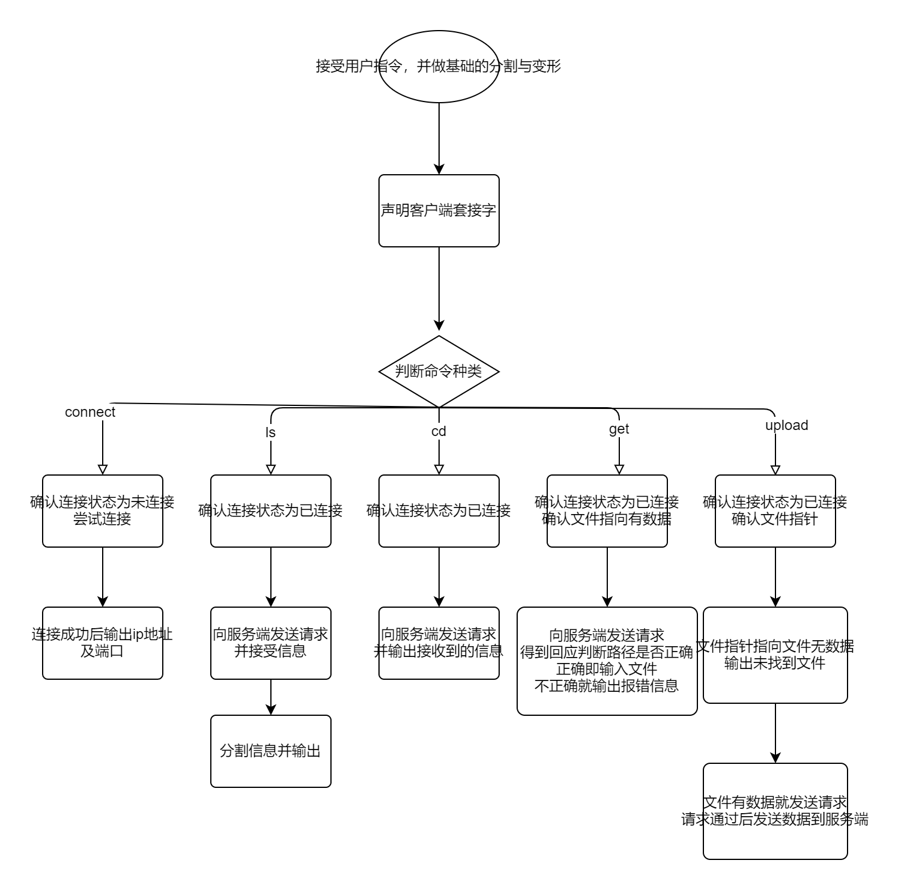

主体部分剩下的命令的具体思想与上述几个命令差不多，由于篇幅的限制就不做赘述，我们另外还实现了help,clear,mkdir,rm,pwd等命令。

首先来看客户端

```py
def print_help():
    print("Support command: connect, ls, cd, get, upload, help, disconnect, exit")
    print("connect: connect to a tcp server, usage: connect <server ip> <server port>")
    print("ls: list files in current directory, usage: ls")
    print("cd: change current directory, usage: cd <directory>")
    print("get: download a file from server, usage: get <remote file name>")
    print("upload: upload a file to server, usage: upload <local file name>")
    print("help: print help message, usage: help")
    print("clear: clear screen, usage: clear")
    print("disconnect: disconnect from server, usage: disconnect")
    print("exit: exit the program, usage: exit")
    return
```

定义了一个help命令来输出所有的支持指令以及参数

然后客户端的主要部分是对于用户命令的操作，将用户命令存储到command中，如果command的长度大于1，说明是带有文件指针的命令，将指针存储到arg下并开始建立套接字

```python
client = socket(AF_INET, SOCK_STREAM)
```

开始进入while循环来循环判断处理每一条命令，主要也就是对于几个边缘状态的讨论，具体可以见附录下的代码

服务端

因为要实现多线程，所以在客户端每一次建立新的连接的时候就创建一个新的线程

```python
newthd = threading.Thread(target = receive_data, args = (tcpconnection, clientaddr, LogFile, filelock, DataPath))
newthd.start()
```

服务端的操作主要是对两个文件的维护上面，一个是日志文件，另一个为数据文件，数据文件是个大类概括，里面可以包含多个文件夹，我们这里将文件夹和文件做了区分，方便命令的实现上面能够区分，如upload中需要判断所要上传的文件名与文件夹中的文件名存不存在冲突，而与文件夹的名字不冲突

```
tcpserver = socket(AF_INET, SOCK_STREAM)
tcpserver.setsockopt(SOL_SOCKET, SO_REUSEADDR, True)
tcpserver.bind(('', port))
tcpserver.listen(128)
```

服务端也通过套接字的方式，然后监听端口，得到请求后建立连接

```python
tcpconnection, clientaddr = tcpserver.accept()
with open(LogFile, 'a') as f:
    filelock.acquire()
    print("Connection with", clientaddr[0] + ':' + str(clientaddr[1]), "is established")
    f.write("Connection with " + clientaddr[0] + ':' + str(clientaddr[1]) + " is established\n")
    filelock.release()
```

建立连接后开始准备接受客户端的请求，接受请求后也就按照请求具体的分类通过像客户端上的操作，具体也可以见附录下的代码

### 三、实验结果

#### A 机器运行服务器软件  在客户端 B 机器的命令行同时运行 4 个客户端  

首先来看两台机器的情况，A作为服务端，B作为客户端

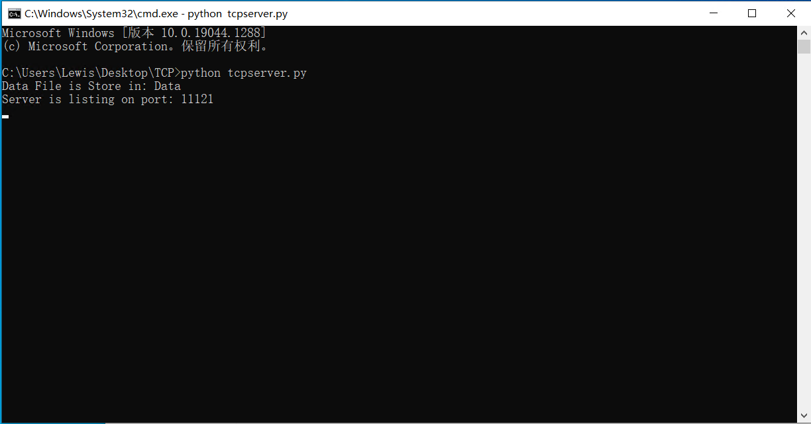


最初界面，A为服务端的界面，然后我们在B中打开四个客户端

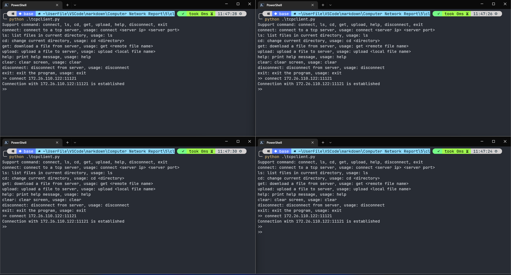

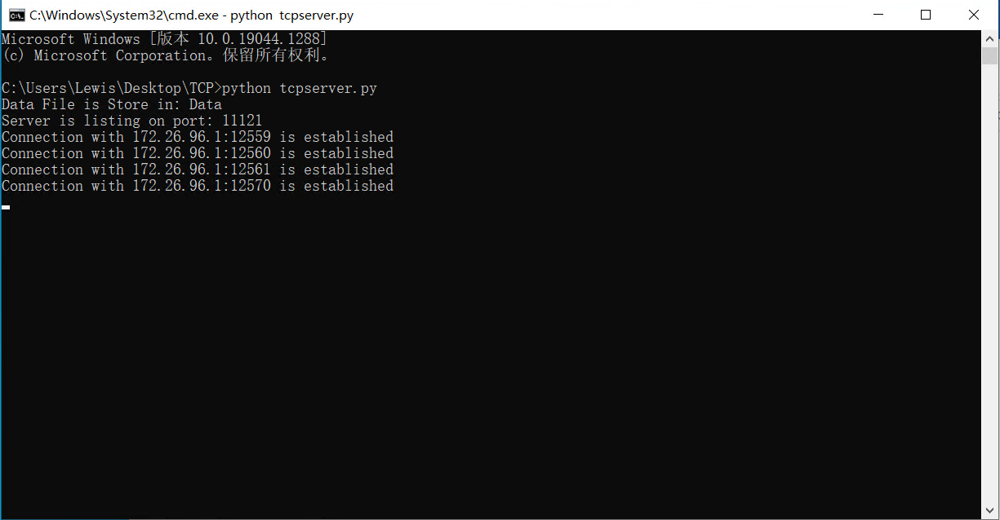

现在是打开了四个客户端你的情况，可以看到服务端界面上上述的ip地址相同，但端口不一样，说明打开并连接上了四个不同的客户端。

客户端界面上每个客户端与服务端的连接都成功。

下面看看不同客户端输入不同命令后服务端的输出

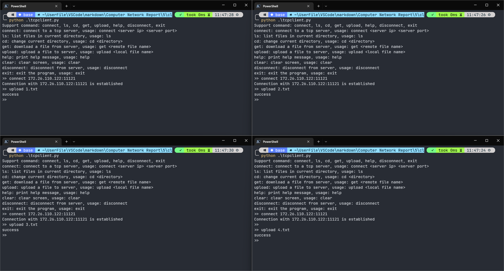

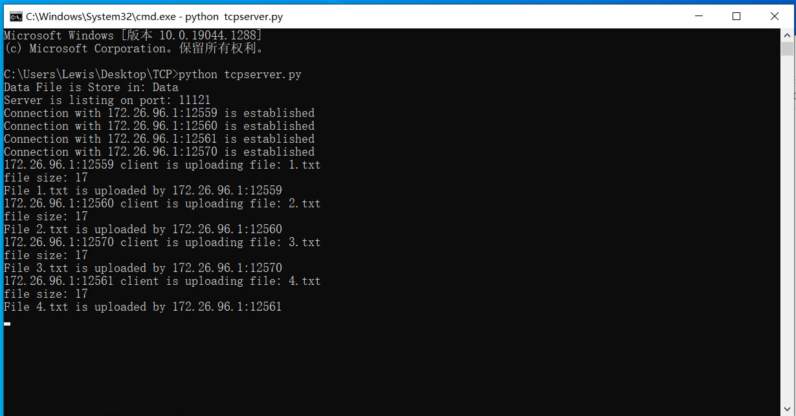

upload：现在尝试从四个不同的客户端往服务端来upload文件，分别设置为1、2、3、4，见上图，输出了文件大小并可以从data文件夹下发现上述文件，并且客户端界面上所有的文件都上传成功传回success信息

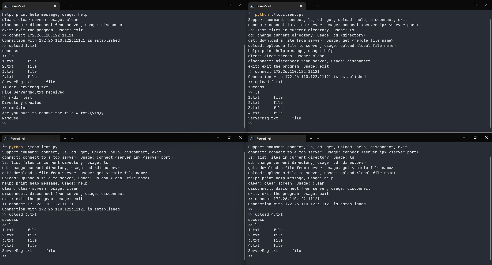

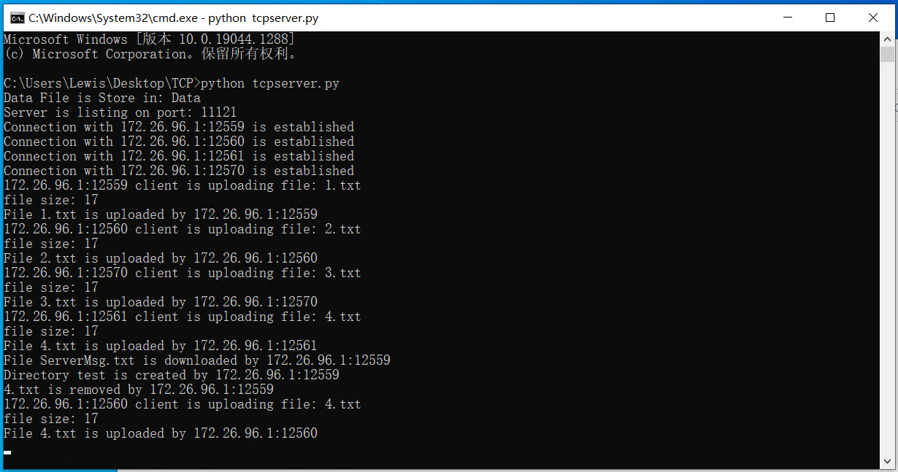

rm：服务端：172.26.96.1:12559将服务端的4.txt移除，客户端：rm命令后传回success信息

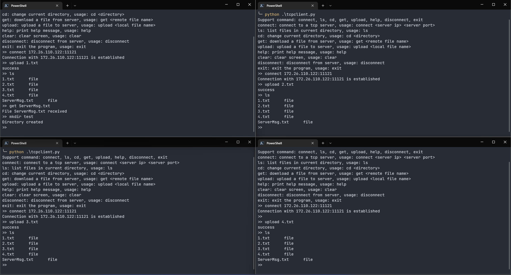

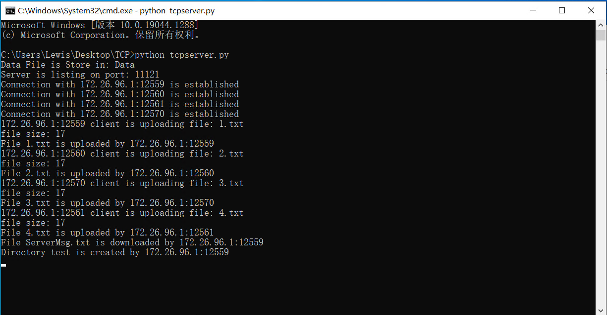

mkdir：创建文件夹命令。客户端：输入命令，返回created信息；服务端：文件夹创建并输出创建文件夹的客户端地址

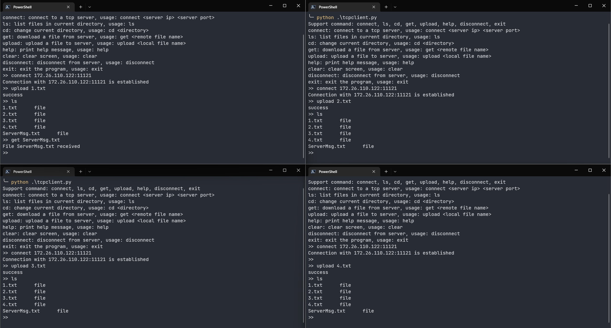

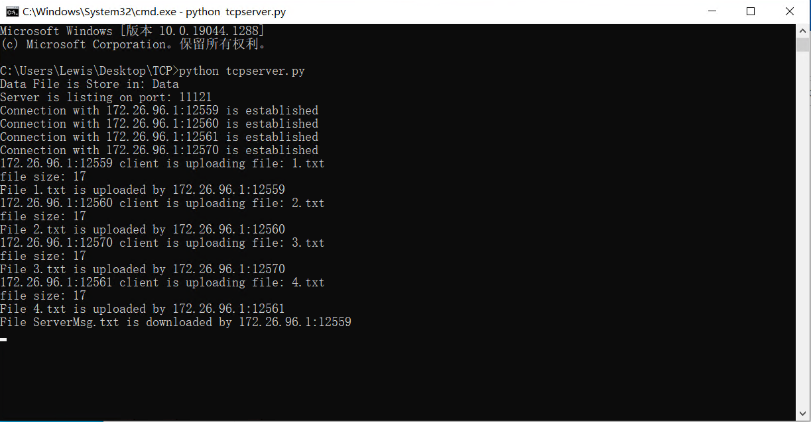

get: 客户端：输入get serverMsg.txt 的命令，返回receive信息；服务端：输出get的文件名以及get的客户端地址

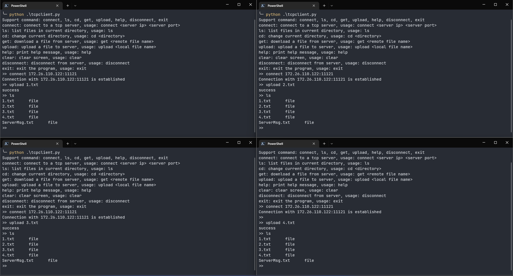

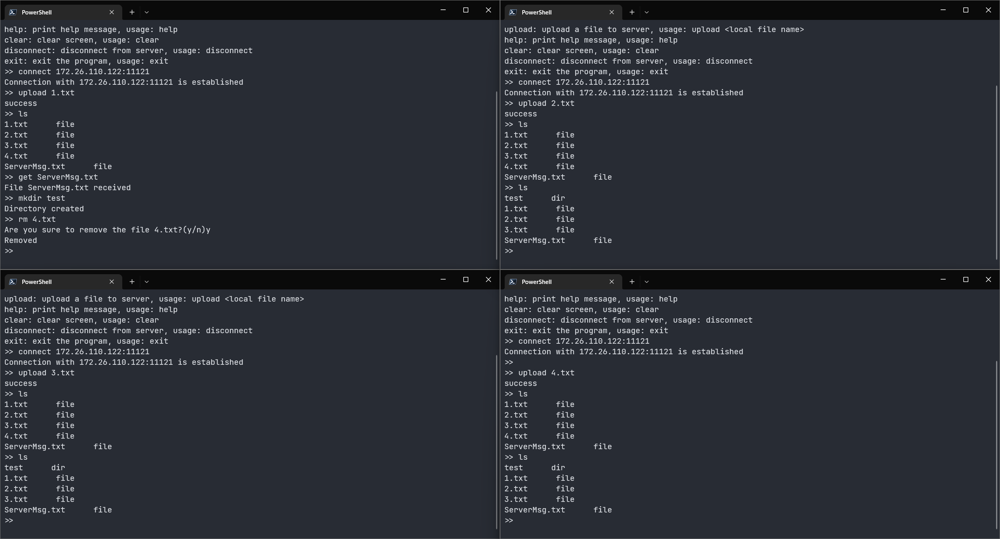

ls: 这里主要的是两次的ls，第一次是初始的时候四个客户端向服务端传了四个文件，通过ls命令可以看到里面有5个txt文件，第二次是通过rm操作后删除了4.txt，通过ls命令可以看到此时只有4个txt文件了，并刚好删除了4.txt

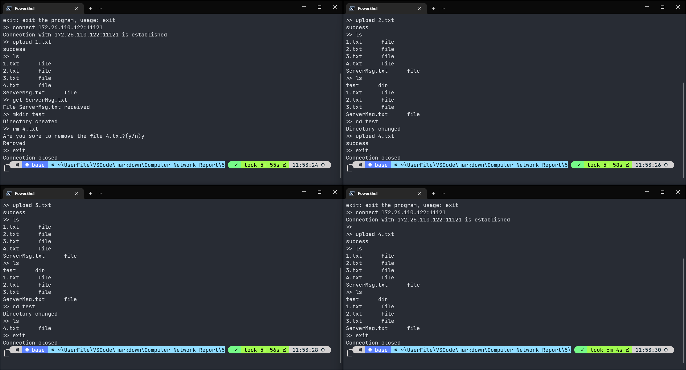

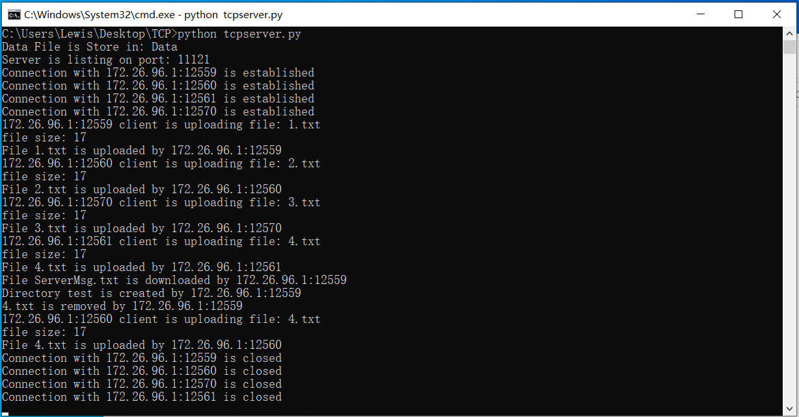

close：四个客户端关闭连接，返回closed，服务端中显示了具体的ip地址以及关闭信息

#### 在 A 机器也同时运行客户端软件 2 个客户端  

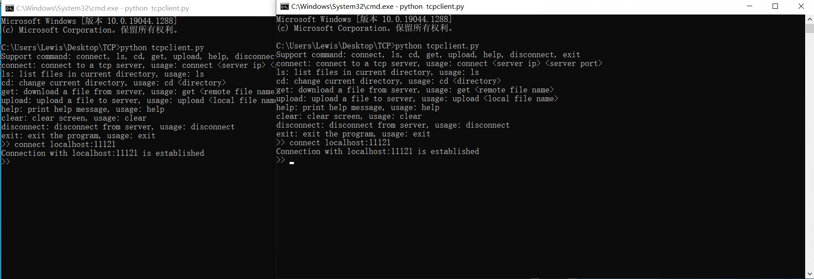

在A机器上同时运行了两个客户端

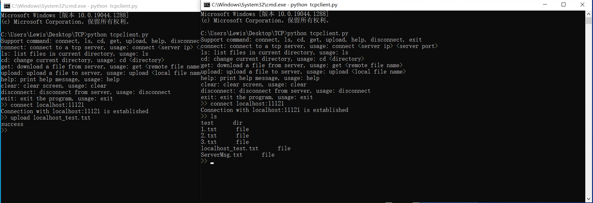

然后在A上的两个客户端一个运行upload命令，另一个通过ls命令发现第一个客户端所上传的test.txt也在第二个客户端上显示

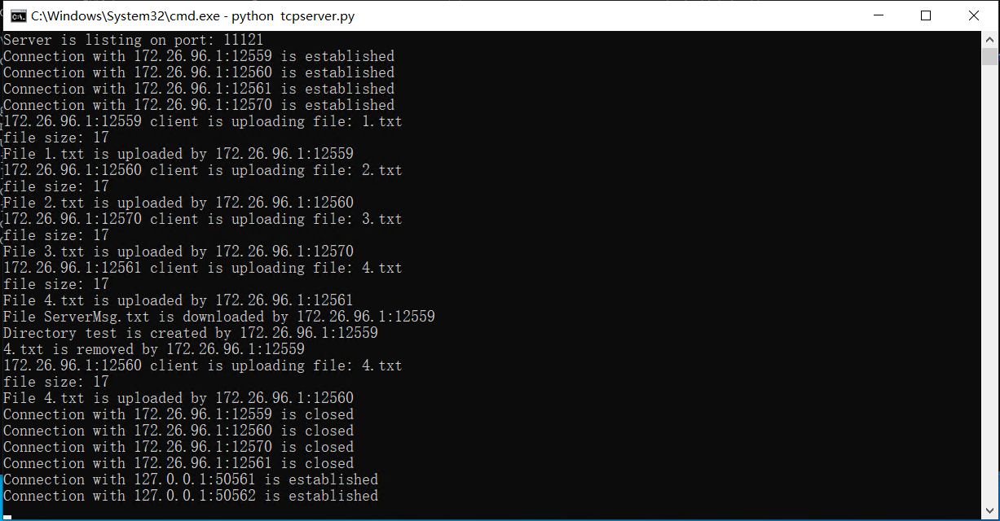

在A上同时运行服务端，可以看到在完成了第一个实验后连接关闭，然后又与自己机器上打开的客户端建立连接

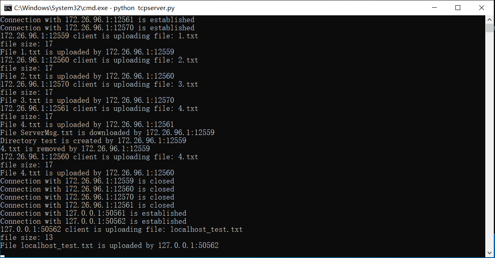

完成了upload以及ls命令后的A的服务端所输出的页面，可以看到一个客户端完成了upload文件localhost_test.txt，实验结束

#### 观看服务器端运行的日志  

日志信息放在server.log文件中，与实验报告一同上交。

