# 计算机网络

## 实验报告

**（2022学年秋季学期）**

| **教学班级** | **计科二班** | **专业（方向）** | **计算机科学与技术** |
| ------------ | ------------ | ---------------- | -------------------- |
| **学号**     | **20337263** | **姓名**         | **俞泽斌**           |

### 一、   实验题目

（1）要求掌握网络抓包软件wireshark的内容包括

1、捕获网络流量进行详细分析

2、利用专家分析系统诊断问题。

3、实时监控网络活动

4、收集网络利用率和错误等信息

（2）协议分析1：IP协议，内容包括IP头的结构、IP数据包的数据结构分析

### 二、实验步骤

#### 分析IP协议

（1）打开wireshark并开始控制台内进入ping baidu.com

将过滤器设置为icmp|| dns后得到结果如图

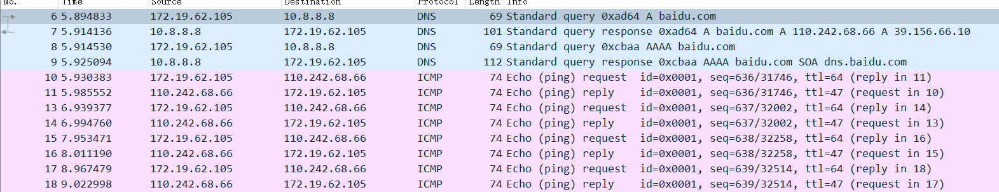

可以看到此时有四条DNS请求和回应，以及ICMP的request和reply操作，现在将ip协议展开，开始具体分析其中的字段

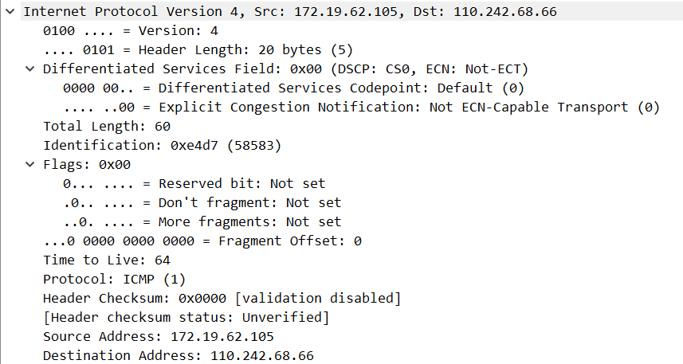

具体建表如下

| 字段       | 值            | 具体字段值                    |
| ---------- | ------------- | ----------------------------- |
| 版本       | ipv4          | Internet Protocol Version 4   |
| 首部长度   | 20 bytes      | Header Length                 |
| 区分服务   | 0x00          | Differentiated Services Field |
| 总长度     | 60            | total length                  |
| 标识       | 0xe4d7        | Identification                |
| 标志       | 0x00          | Flags                         |
| 片偏移     | 0             | Fragment offset               |
| 生存时间   | 64            | Time to Live                  |
| 协议       | ICMP          | Protocol                      |
| 检验和     | 0x0000        | Header Checksum               |
| 原IP地址   | 172.19.62.105 | Src                           |
| 目的IP地址 | 110.242.68.66 | Destination                   |

（2）当前网关为

```c
Default Gateway . . . . . . . . . : fe80::a68:8dff:fea5:1e01%13
                                       172.19.63.254
```

```c
ping -l 4500 -n 2 172.19.63.254
```

输入上述命令后控制台结果

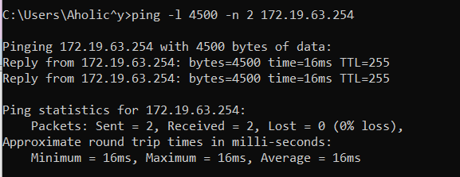

wireshark 捕获结果

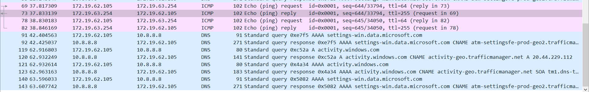

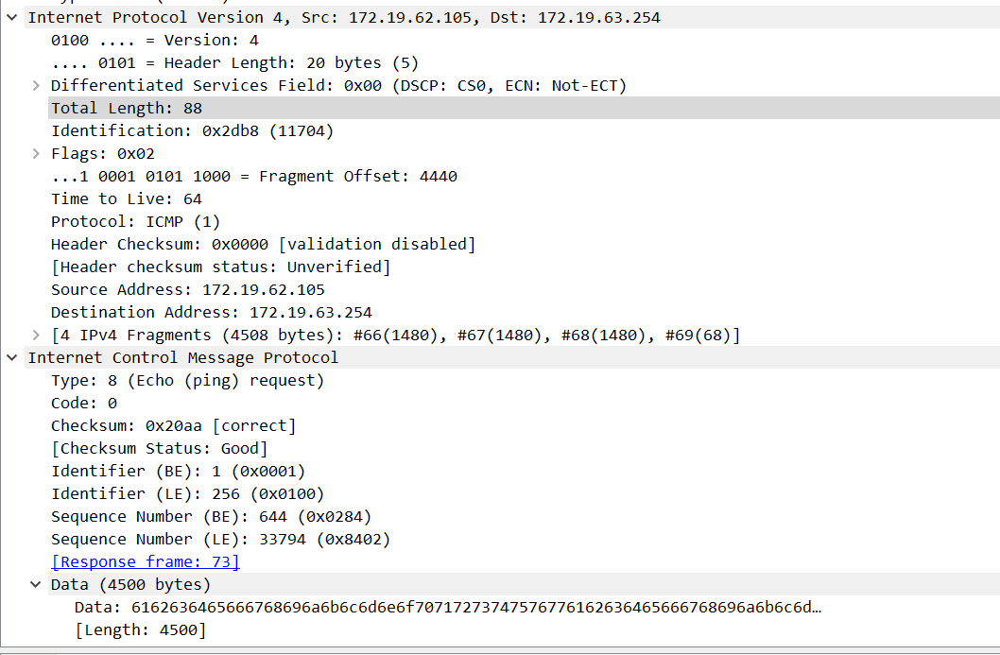


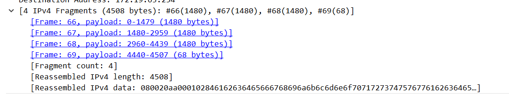

单独看上面的过滤器所产生的报文时发现，第一个报文内有4个分片

可以看到此时的data长度为1480bytes，头部的字段长度为20bytes，所以以太网的MTU为1500bytes。

上述发现一个报文内可能有多个分片，所以此时将过滤器改为ip.addr==172.19.63.254

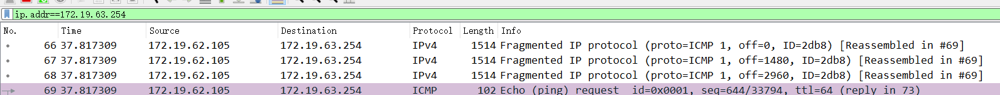

属于同一个ICMP请求的分片有4个，分别为图中的No.66,67,68,69

每一个分片的满的有效长度为1480，若要将ping发起端发送的数据分为3个分片，ping命令中的报文长度应该设置为2961~4440之间

#### 分析UDP协议

（1）因为windows下的tracert命令发送的是ICMP的包，所以这次实验采用在unbuntu虚拟机的环境下进行，

输入命令

```c
traceroute ucdavis.edu
```

控制台就结果如图

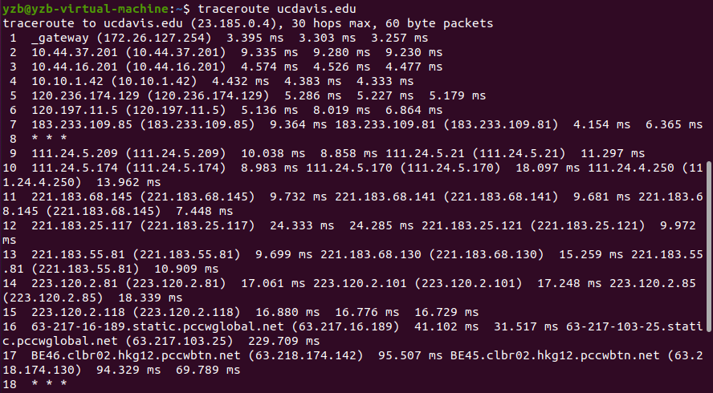

wireshark抓包得到结果如下

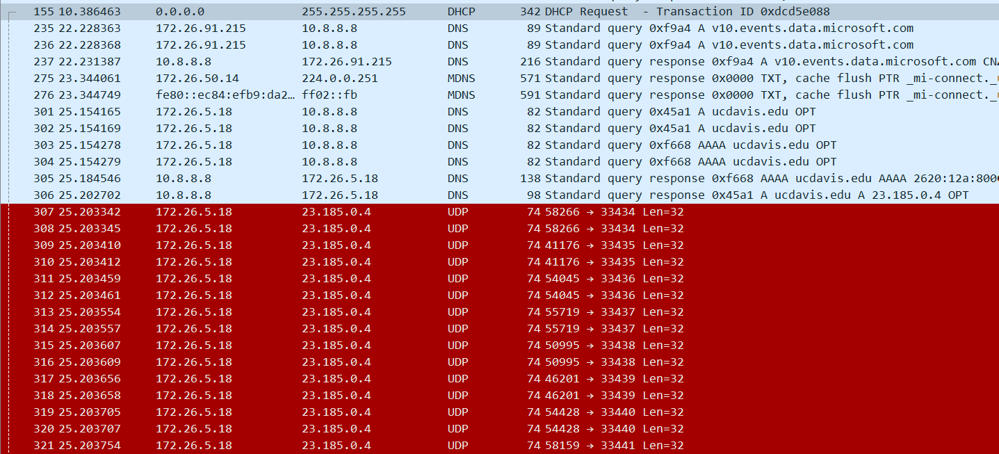

下面来对信息具体分析

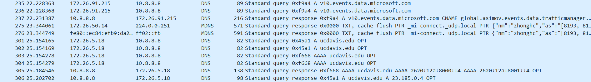

开始是对ucdavis.edu的域名解析，是用了DNS的协议来进行，具体的解析过程前面几个实验中也涉及到了，就是通过一层一层的DNS服务器来向本地返回所需要访问域名的ip地址

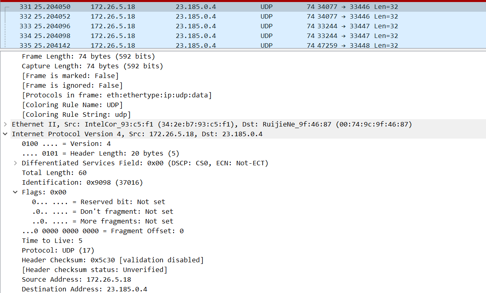

具体分析其中一条udp协议请求，先截取了网络层的报文内容

| 字段                          | 值          | 意义         |
| ----------------------------- | ----------- | ------------ |
| Version                       | 4           | 代码ipv4协议 |
| Differentiated Services Field | 0x00        | 区分服务     |
| header length                 | 20 bytes    | 头部字段长度 |
| total length                  | 60          | 总长度       |
| Identification                | 0x9098      | 标识符       |
| Time to live                  | 5           | 生存时间     |
| Protocol                      | UDP         | UDP协议      |
| Source Address                | 172.26.5.18 | 主机ip地址   |
| Destination Address           | 23.185.0.4  | 目标ip地址   |

传输层/UDP层

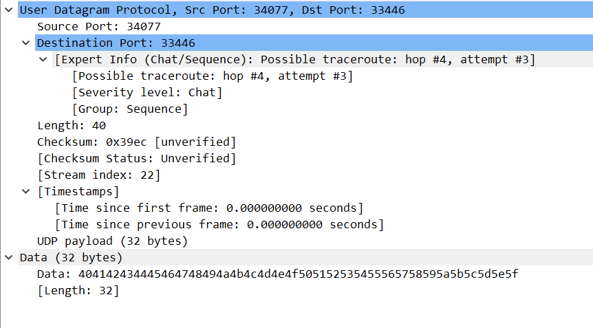

| 字段     | 值     | 意义       |
| -------- | ------ | ---------- |
| Src Port | 34077  | 主机端口   |
| Dst Port | 33446  | 目标端口   |
| checksum | 0x39ec | 数据校验和 |

所以traceroute ucdavis.edu的流程主要有以下几个方面

首先，本地开始解析ucdavis.edu这个域名的ip地址，向上一级DNS服务器进行请求，逐级请求下得到ucdavis.edu的ip地址为23.185.0.4

然后主机172.26.5.18开始想域名对应的ip地址发一个TTL=1的[UDP](https://so.csdn.net/so/search?q=UDP&spm=1001.2101.3001.7020)数据包，而经过的第一个路由器收到这个数据包以后，就自动把TTL减1，而TTL变为0以后，路由器就把这个包给抛弃了，并同时产生 一个主机不可达的ICMP数据报给主机。

主机收到这个数据报以后再发一个TTL=2的UDP数据报给目的主机，然后刺激第二个路由器给主机发ICMP数据报。如此往复直到到达目的主机。

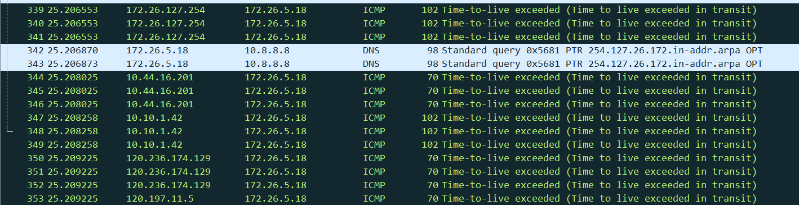

ip数据包的内容为udp传输层下的data数据，如下图

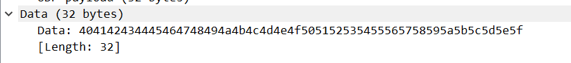