# 计算机网络

## 实验报告

**（2022学年秋季学期）**

| **教学班级** | **计科二班** | **专业（方向）** | **计算机科学与技术** |
| ------------ | ------------ | ---------------- | -------------------- |
| **学号**     | **20337263** | **姓名**         | **俞泽斌**           |

| **教学班级** | **计科二班** | **专业（方向）** | **计算机科学与技术** |
| ------------ | ------------ | ---------------- | -------------------- |
| **学号**     | **20308003** | **姓名**         | **曾伟超**           |

### 一、	实验题目

掌握通过静态路由方式实现网络连通性

本实验的预期目标是在路由器R1和R2上配置静态路由，使pc1和pc2在跨路由器的情况下能够实现互联互通

### 二、	实验步骤

#### 首先来配置pc1和pc2的ip地址，子网掩码，网关

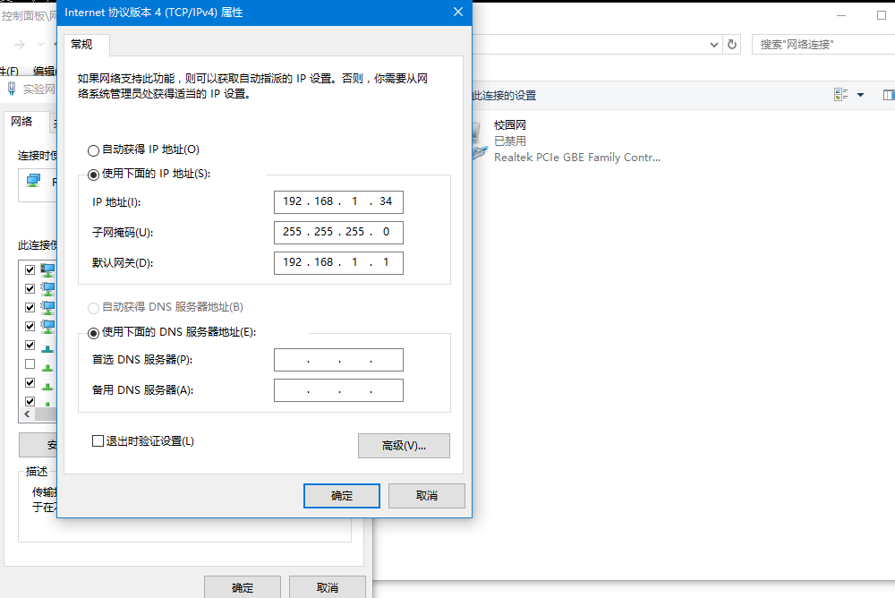

是在具体的路由器的网络基地址下自己分配了一个地址，为192.168.1.34，pc2同理，设置为192.168.3.5，方便之后的ping测试

#### 现在开始配置R1及R2的路由器端口ip地址

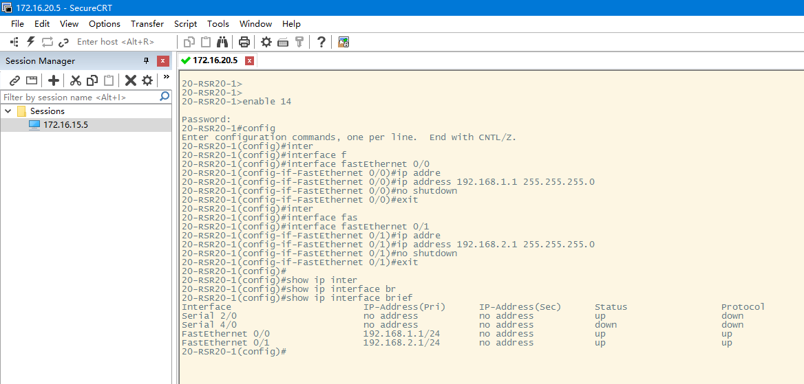

进入0/0和0/1的端口模式后，开始通过ip address命令来配置具体端口的ip地址以及子网掩码，具体配置的地址参考书上的拓扑结构

同时通过

```
show ip interface brief
```

命令来得到两个端口具体的ip地址，发现此时ip地址以及变成了我们所需要的那个，所以R1部分的ip配置成功

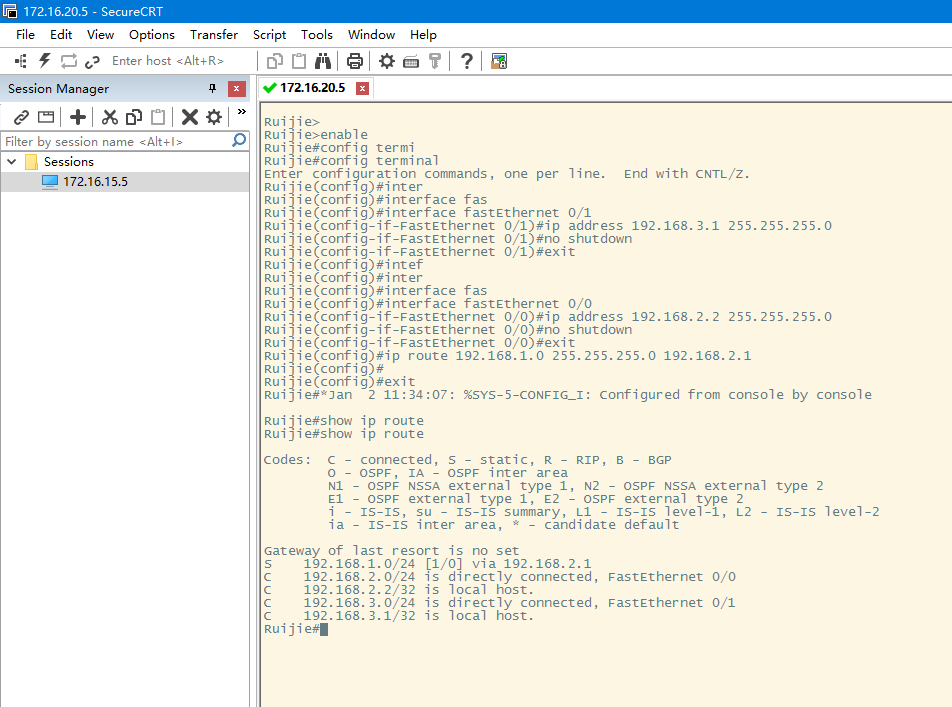

对于R2的配置也与上面一只，设置地址分别为192.168.3.1和192.168.2.2，分别为路由器与pc连接的端口以及两个路由器互相连接的端口

#### 在R1及R2上配置静态路由

同时配置静态路由，通过ip route命令来检验R2上的静态路由配置

路由表中是有S条目的的，通过之前的ip route 命令，确定了路由器转发的消息的源端口和目标端口，所以产生了S条目

#### 测试网络连通性

首先我们通过ping命令来进行实验中途的调试操作

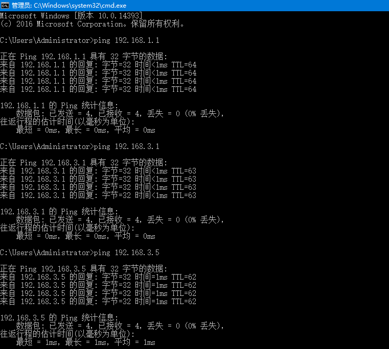

主要其实是两个层次之间的连通，

首先是从pc1到R1端口，也就是我们设置的192.168.1.1地址，发现能够ping通，说明从pc1到R1的路线是已经配置好连通的。

然后是R1和R2之间的连通操作，ping 192.168.3.1，也ping成功，说明R1和R2之间的互联也做好了

最后才是ping一下pc2的地址，来确保整条路线全部畅通

##### （1）将此时的路由表与之前的比较，有什么结论

此时的路由表

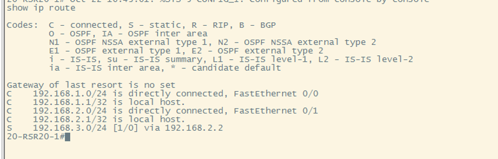

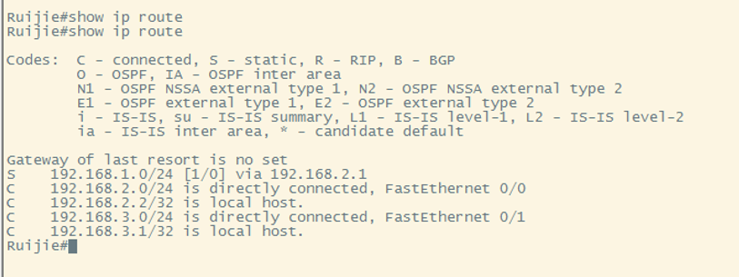

而在最初始的情况下，我们并没有设置过路由表中几个端口的地址，包括接线也没有过，主要的区别可能就在于多了一个S条目，即ip route 的配置，还多了两个directly connected，通过ip地址的设定以及接线的操作

##### （2）对pc1执行traceroute命令

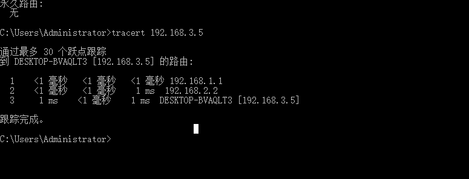

通过tracert命令，可以很清楚的看到我们设计的链路，从本机192.168.1.34到R1  192.168.1.1，再从R1到R2 的192.168.2.2。最后从R2接入目标主机

##### （3）启动wireshark 测试连通性，分析捕获的数据包

我这里是采用从pc1向pc2进行ping命令后然后在pc1上启动wireshark进行抓包

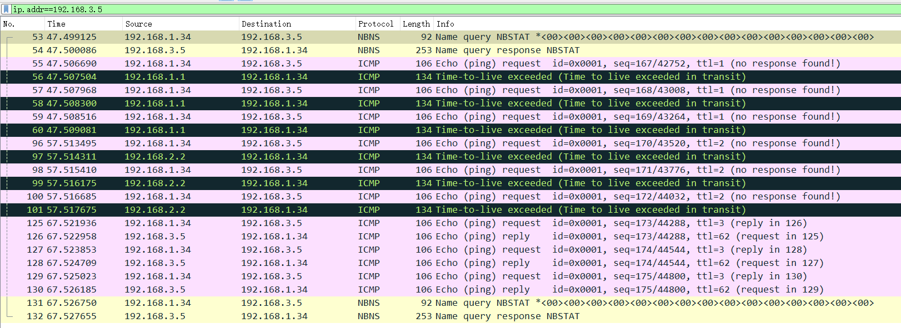

设置过滤器为ip.addr==192.168.3.5，也就是我们直接来看最终的目标主机对pc1的ping命令有没有进行回复，也就是是否ping通，通过wireshark抓包可以发现，192.168.3.5向192.168.1.34发送了ping的reply，有了双向的交互，说明连通性完好

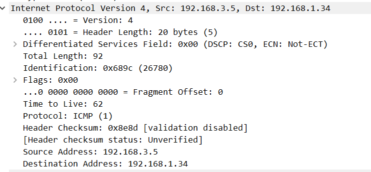

具体看一次返回报文，也就是通过ICMP协议发过来的，是一个ping reply操作

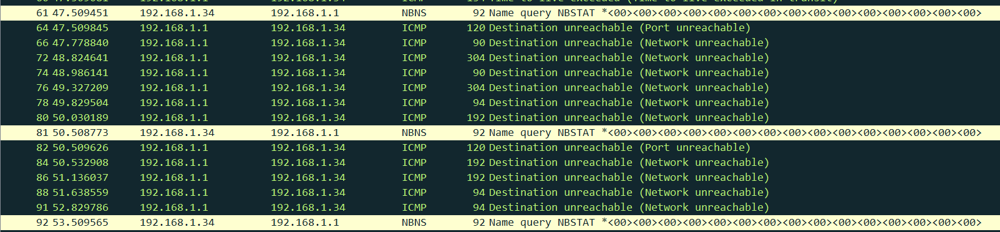

从路径上的路由器也可以看出，主机192.168.1.34向R1路由器发送了三次ping的数据包，也是遵从我们所设计的路线来进行的

##### （4）在计算机命令窗口执行route print 命令，此时的路由表信息与之前相同吗

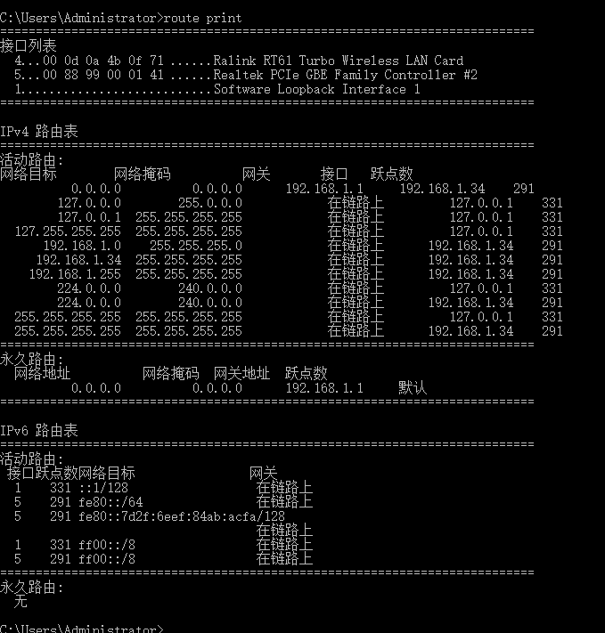

这是配置后pc1的route print命令，可以看到此时网络目标中出现了192.168.1.1的，也就是我们第一个路由器的网关，表明此时pc1已经和R1连通

### 三、 实验思考

##### （1）实验中如果步骤5时ping不通，试分析一下可能的原因

这也是我们实验中犯的一些操作

1、R1或R2的端口ip地址配置错误

2、R1或R2的静态路由配置错误，很大可能是把R1和R2中的静态路由地址和本地地址混淆了导致

3、接线错误，因为配置ip地址的端口之间都有互相的对应，比如对0/0或者0/1配置等，需要辨别

4、没有关闭防火墙即屏蔽校园网，只在试验网环境下进行

##### （2) show命令

1、查看R1快速以太网端口0/1的具体信息

```
show interfaces fastEthernet 0/1
```

2、找出R2所有端口上关于IP地址配置的有关信息，并指出哪一个路由条目是静态路由

```
show ip interface brief
```


图中S项为静态路由

3、查看R1的路由表，并指出那一个路由条目是静态路由

```
show ip route
```

##### (3)每个路由条目包含哪几项，分别有什么含义？


以上述路由表为例，

第一项的目标地址为192.168.1.0，即主机地址，是通过之间网线进行连接，下一跳直接到达，保持为connect状态

第二项的目标地址为192.168.1.1，是配置的R1端口地址，即local host 本地地址

第三项的目标地址为192.168.2.0，即静态路由的中间地址，下一跳也可以到达，保持connect

第四项的目标地址为192.168.2.1，是配置的R1端口地址，即local host 本地地址

最后一项是静态路由，即告诉路由器这个目标网络应该通过什么方式过去，下一跳地址为 多少

##### （4）路由器中如果同时存在去往同一个网段的静态路由和动态路由信息，路由器会采用哪一个进行转发

路由器会优先选择静态路由；因为静态路由更易于监管，更容易到达；管理距离值更低，更可信；