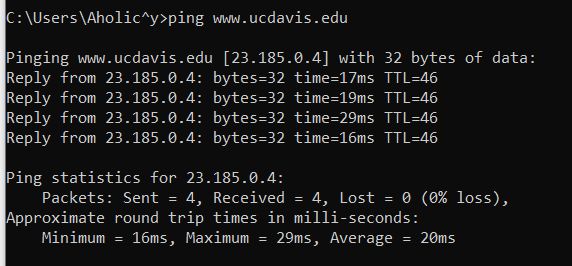
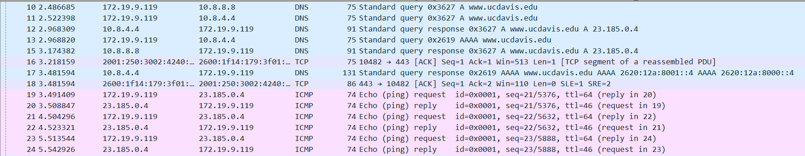
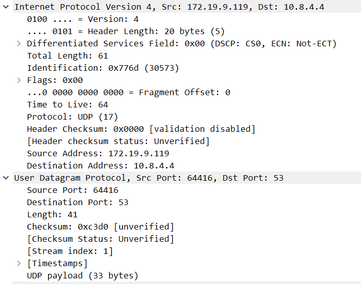
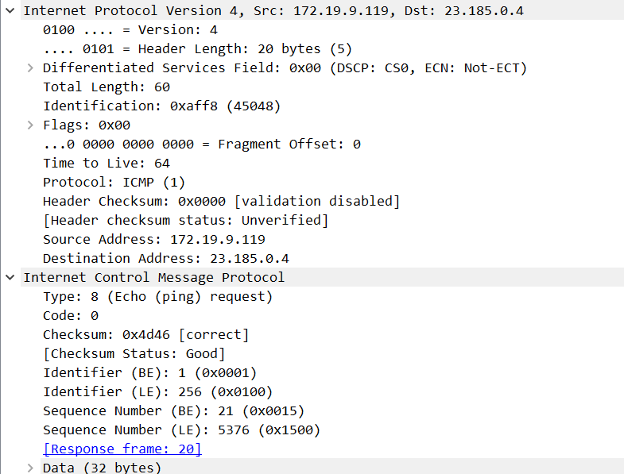
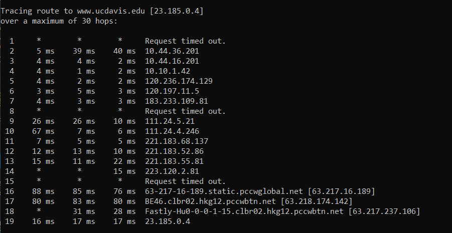
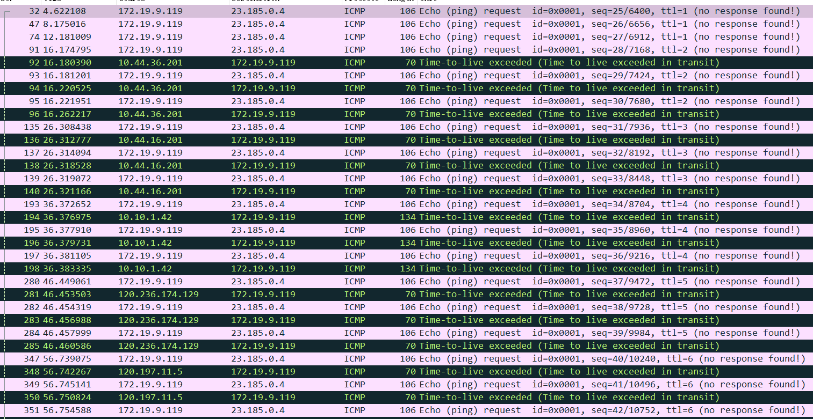
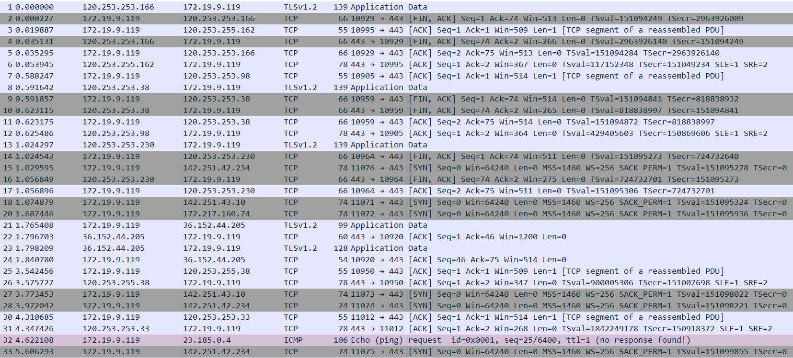
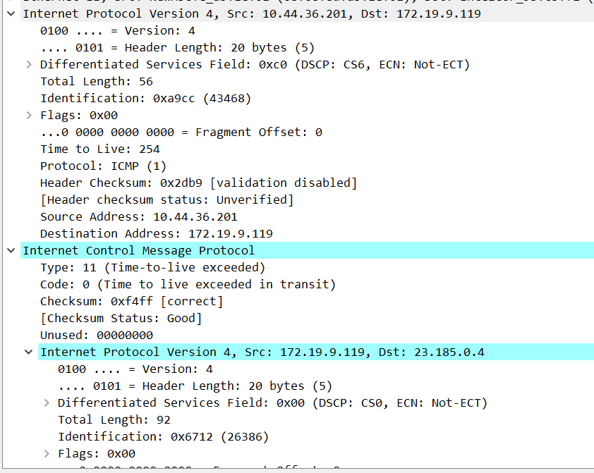

# 计算机网络

## 实验报告

**（2022学年秋季学期）**

| **教学班级** | **计科二班** | **专业（方向）** | **计算机科学与技术** |
| ------------ | ------------ | ---------------- | -------------------- |
| **学号**     | **20337263** | **姓名**         | **俞泽斌**           |

## 一、	实验题目

##### 利用 wireshark 分析 ICMP 及相关 IP 数据包服务  

1）在实验机器终端启动 wireshark 抓包,设置过滤显示 IP，ICMP，UDP 和 TCP 相关的信息；
2） 运行命令 ping 命令
ping www.ucdavis.edu
3） 截图显示网络层 IP、ICMP 协议,传输层协议的活动；观察期间数据传输；  

##### 利用 wireshark 分析 ICMP/UDP 及相关 IP 服务  

1）在实验机器终端启动 wireshark 抓包,设置过滤显示 IP，ICMP，UDP 相关的信息；
2） 运行命令 traceroute 命令（windows 的是 tracert）
Tracert www.ucdavis.edu
3） 截图显示网络层 IP、ICMP 协议，传输层及 UDP 相关的信息；观察期间数据传输；
4） 分析并解释以上实验结果  

## 二、    实验步骤

#### 利用 wireshark 分析 ICMP 及相关 IP 数据包服务  

首先启动wireshark抓包，并,设置过滤显示 IP，ICMP，UDP 和 TCP 

将过滤器设置为

```
icmp ||udp ||tcp ||ip
```

在命令行窗口运行



主要得到报文如下



主要截取的是DNS和ICMP部分

然后我们首先来看DNS的网络层部分



| 字段       | 值           | 具体字段值                    |
| ---------- | ------------ | ----------------------------- |
| 版本       | ipv4         | Internet Protocol Version 4   |
| 首部长度   | 20 bytes     | Header Length                 |
| 区分服务   | 0x00         | Differentiated Services Field |
| 总长度     | 61           | total length                  |
| 标识       | 0x776d       | Identification                |
| 标志       | 0x00         | Flags                         |
| 片偏移     | 0            | Fragment offset               |
| 生存时间   | 64           | Time to Live                  |
| 协议       | UDP          | Protocol                      |
| 检验和     | 0x0000       | Header Checksum               |
| 原IP地址   | 172.19.9.119 | Src                           |
| 目的IP地址 | 10.8.4.4     | Destination                   |

可以看到ping命令一开始是通过DNS服务，在运输层中使用UDP协议来得到具体的数据以及目标域名的IP地址

接下来是ICMP的协议部分




| 字段       | 值           | 具体字段值                    |
| ---------- | ------------ | ----------------------------- |
| 版本       | ipv4         | Internet Protocol Version 4   |
| 首部长度   | 20 bytes     | Header Length                 |
| 区分服务   | 0x00         | Differentiated Services Field |
| 总长度     | 60           | total length                  |
| 标识       | 0xaff8       | Identification                |
| 标志       | 0x00         | Flags                         |
| 片偏移     | 0            | Fragment offset               |
| 生存时间   | 64           | Time to Live                  |
| 协议       | ICMP         | Protocol                      |
| 检验和     | 0x4d46       | Header Checksum               |
| 原IP地址   | 172.19.9.119 | Src                           |
| 目的IP地址 | 23.185.0.4   | Destination                   |

大体的字段与上面的解释相同，就是协议改成了ICMP协议，来传达ping命令的request和reply，然后这里因为涉及了具体的数据传输有了校验和的值以及标识字段

#### 利用 wireshark 分析 ICMP/UDP 及相关 IP 服务  

##### 分析ICMP

首先分析ICMP的操作，在Windows条件下运行

```
Tracert www.ucdavis.edu
```



wireshark抓包如下

设置过滤器为ICMP时



设置过滤器为ICMP||IP时



此时可以看到本地主机  172.19.9.119向其他地址发送请求数据包，然后收到路径上的部分数据包，从而在命令行中得到

主机172.26.5.18开始想域名对应的ip地址发一个TTL=1的[UDP](https://so.csdn.net/so/search?q=UDP&spm=1001.2101.3001.7020)数据包，而经过的第一个路由器收到这个数据包以后，就自动把TTL减1，而TTL变为0以后，路由器就把这个包给抛弃了，并同时产生 一个主机不可达的ICMP数据报给主机。

主机收到这个数据报以后再发一个TTL=2的UDP数据报给目的主机，然后刺激第二个路由器给主机发ICMP数据报。如此往复直到到达目的主机。

接下来具体看一个icmp 的数据包



这是从目标地址向本地地址发送的错误信息，因为TTL结束了，说明所定义的TTL无法到达具体的目标地址，需要再加一个TTL来重新进行

type=11， code =0，说明TTL expired ，这就是目标发来的报错信息

##### 分析UDP协议

（1）因为windows下的tracert命令发送的是ICMP的包，所以这次实验采用在unbuntu虚拟机的环境下进行，

输入命令

```c
traceroute ucdavis.edu
```

控制台就结果如图


wireshark抓包得到结果如下


下面来对信息具体分析


开始是对ucdavis.edu的域名解析，是用了DNS的协议来进行，具体的解析过程前面几个实验中也涉及到了，就是通过一层一层的DNS服务器来向本地返回所需要访问域名的ip地址


具体分析其中一条udp协议请求，先截取了网络层的报文内容

| 字段                          | 值          | 意义         |
| ----------------------------- | ----------- | ------------ |
| Version                       | 4           | 代码ipv4协议 |
| Differentiated Services Field | 0x00        | 区分服务     |
| header length                 | 20 bytes    | 头部字段长度 |
| total length                  | 60          | 总长度       |
| Identification                | 0x9098      | 标识符       |
| Time to live                  | 5           | 生存时间     |
| Protocol                      | UDP         | UDP协议      |
| Source Address                | 172.26.5.18 | 主机ip地址   |
| Destination Address           | 23.185.0.4  | 目标ip地址   |

传输层/UDP层


| 字段     | 值     | 意义       |
| -------- | ------ | ---------- |
| Src Port | 34077  | 主机端口   |
| Dst Port | 33446  | 目标端口   |
| checksum | 0x39ec | 数据校验和 |

所以traceroute ucdavis.edu的流程主要有以下几个方面

首先，本地开始解析ucdavis.edu这个域名的ip地址，向上一级DNS服务器进行请求，逐级请求下得到ucdavis.edu的ip地址为23.185.0.4

然后主机172.26.5.18开始想域名对应的ip地址发一个TTL=1的[UDP](https://so.csdn.net/so/search?q=UDP&spm=1001.2101.3001.7020)数据包，而经过的第一个路由器收到这个数据包以后，就自动把TTL减1，而TTL变为0以后，路由器就把这个包给抛弃了，并同时产生 一个主机不可达的ICMP数据报给主机。

主机收到这个数据报以后再发一个TTL=2的UDP数据报给目的主机，然后刺激第二个路由器给主机发ICMP数据报。如此往复直到到达目的主机。


ip数据包的内容为udp传输层下的data数据，如下图

